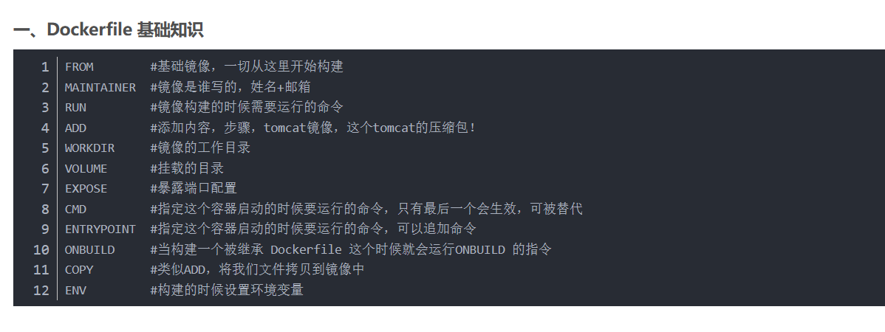

生成镜像报错：

failed to solve: failed to read dockerfile: open /var/lib/docker/tmp/buildkit-mount1551875758/Dockerfile: no such file or directory

造成这个问题的原因看了官方的文档后发现没有指定对应的dockerfile，所以修改了指令后就可以正常生成镜像了（后面的-t是指定镜像文件的名称）

docker build -f .\dockerfile.dockerfile . -t alist

查看容器：docker ps -a

进入某个容器目录内：docker exec -it <容器名> <路径>

目录挂载：docker run -di --name=<容器名称> -v <宿主机目录>:<容器目录> <镜像名称>

使用此命令成功挂载alist

> docker run -d --restart=always -v E:/cloudDepository:/var/local -v E:/myalist:/opt/alist/data -p 5244:5244 -e PUID=0 -e PGID=0 -e UMASK=022 --name="myalist" xhofe/alist:v3.22.0
> 
> -v 挂载文件夹
> 
> > 把本地存储和配置信息映射到本地
> 
> -p 映射端口
> 

## 理论

#### 1. docker本地挂载

docker本地挂载有两个概念：挂载覆盖、双向读写
挂载覆盖：本地挂载路径的内容会覆盖掉容器内挂载路径的内容，但不是删除，只是暂时隐藏了容器目录原有的内容。本地目录的内容会优先显示。
双向读写：挂载后，本地和容器都可以读写挂载的目录。

#### 2. network

容器启动默认会运行在默认的 `bridge` 网络（`172.17.0.0/16`）中，此时改网段内的容器可以相互使用ip访问，但是无法使用容器名访问；
对于一些需要容器间相互协作的服务中，一般先创建一个自定义network，把需要的服务加入网络，之后容器间就可以使用容器名进行访问，解决了容器重启ip可能变化的情况。

#### 3. docker compose

Compose 是用于定义和运行多容器 Docker 应用程序的工具。通过 Compose，您可以使用 YML 文件来配置应用程序需要的所有服务。然后，使用一个命令，就可以从 YML 文件配置中创建并启动所有服务。

## 问题

## 创新