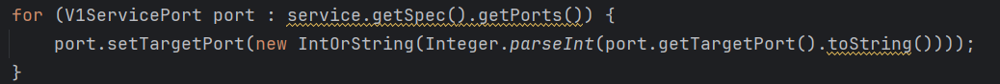
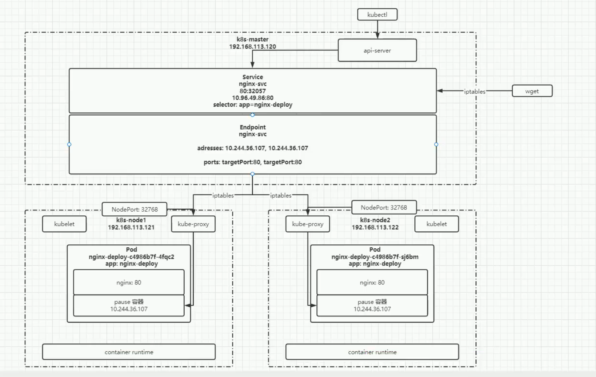

ssh连接：

ssh user@35.236.5.46 -p 22


如果不使用持久化，对于环境的配置一定要在dockerfile配置好，不然每次容器重启都会丢失环境


k8s clilent构建需要的环境变量：在容器创建之前，kubelet会注入环境变量，但某些原因会导致环境注入失败

```
export KUBERNETES_SERVICE_HOST=10.96.0.1
export KUBERNETES_SERVICE_PORT=443
export KUBERNETES_SERVICE_PORT_HTTPS=443
export KUBERNETES_PORT_443_TCP=tcp://10.96.0.1:443
export KUBERNETES_PORT_443_TCP_PROTO=tcp
export KUBERNETES_PORT_443_TCP_ADDR=10.96.0.1
export KUBERNETES_PORT=tcp://10.96.0.1:443
export KUBERNETES_PORT_443_TCP_PORT=443
export TOKEN=$(cat /var/run/secrets/kubernetes.io/serviceaccount/token)
export CACERT=/var/run/secrets/kubernetes.io/serviceaccount/ca.crt
export NAMESPACE=$(cat /var/run/secrets/kubernetes.io/serviceaccount/namespace)
```


wsl虚拟机宿主机相互访问

虚拟机访问宿主机：/mnt/盘符


### `AppsV1Api`

- **用途**：`AppsV1Api` 类用于与 Kubernetes 中的应用相关的资源进行交互。这包括了部署、状态副本集、DaemonSet 等应用级的资源。
- **资源类型**：常见的资源类型有：
  - Deployment (`V1Deployment`)
  - StatefulSet (`V1StatefulSet`)
  - DaemonSet (`V1DaemonSet`)
  - ReplicaSet (`V1ReplicaSet`)
  - ControllerRevision (`V1ControllerRevision`)
- **示例方法**：
  - `listNamespacedDeployment()`: 列出命名空间中的所有 Deployment。
  - `createNamespacedStatefulSet()`: 创建一个新的 StatefulSet。
  - `readNamespacedDaemonSet()`: 获取一个 DaemonSet 的详细信息。


### `CoreV1Api`

- **用途**：`CoreV1Api` 类用于与 Kubernetes 中的核心资源进行交互。这包括了 Pod、Service、ConfigMap、Secret、Namespace 等基础资源。
- **资源类型**：常见的资源类型有：
  - Pod (`V1Pod`)
  - Service (`V1Service`)
  - ConfigMap (`V1ConfigMap`)
  - Secret (`V1Secret`)
  - Node (`V1Node`)
  - Namespace (`V1Namespace`)
  - PersistentVolume (`V1PersistentVolume`)
  - PersistentVolumeClaim (`V1PersistentVolumeClaim`)
- **示例方法**：
  - `listNamespacedPod()`: 列出命名空间中的所有 Pod。
  - `createNamespacedService()`: 创建一个新的 Service。
  - `readNamespacedConfigMap()`: 获取一个 ConfigMap 的详细信息。
  - `listNode()`: 列出所有节点。
  - `createNamespace()`: 创建一个新的命名空间。


使用createNamespacedService函数时，死活不能创建出来，报错Unprocessable Entity，发现yaml解析时把targetport解析成了字符串，targetport可以用字符串和int标识，使用字符串时标识pod中的命名端口，不能是纯数字，所以报错

解决办法：




修改对象后的属性值需要提交给k8s才会生效：

使用 `replaceNamespacedStatefulSet` 和 `replaceNamespacedDeployment` 方法将修改后的对象提交回 Kubernetes 集群。


### 网络



port：访问service的端口
targetport：访问pod的端口


## 进入容器

```
<1>

kubectl get pods   #查看所有正在运行的pod

NAME                            READY     STATUS    RESTARTS   AGE

nginx-56b8c64cb4-t97vb          1/1       Running   3          1d

<2>

➜  ~ kubectl exec -it nginx-56b8c64cb4-t97vb -- /bin/bash      #假如当前pod只有一个容器,运行以下命令即可

root@nginx-56b8c64cb4-t97vb:/# ps -ef

UID        PID  PPID  C STIME TTY          TIME CMD

root         1     0  0 14:45 ?        00:00:00 nginx: master process nginx -g daemon off;

<3>假如一个pod里有多个容器,用--container or -c 参数。例如:假如这里有个Pod名为my-pod,这个Pod有两个容器,分别名为main-app 和 helper-app,下面的命令将打开到main-app的shell的容器里。

kubectl exec -it my-pod --container main-app -- /bin/bash
```


创建资源
kubectl create [deployment、] name [--argName-value]

更改deployment内容
kubectl edit deploy deployname

查看pod日志
kubectl logs name

导出deployment yaml
kubectl get deployment <deployment-name>  -n  <namespace> -o yaml   > <deployment-name>.yaml

apply -f应用该yaml文件

使用 `kubectl get events` 命令查看最近的事件日志
kubectl get events --sort-by='.metadata.creationTimestamp'


开发环境连接k8s集群内

需要配置kubeconfig文件

其中server指向集群内的api服务器，但是一般都是内网，需要配置方向代理进行访问

```
apiVersion: v1
kind: Config
clusters:
- cluster:
    server: http://36.138.114.105:31282
    certificate-authority-data: MIIDBTCCAe2gAwIBAgIIS+Cp9oecllYwDQYJKoZIhvcNAQELBQAwFTETMBEGA1UE
                                AxMKa3ViZXJuZXRlczAeFw0yNDA1MjgwMjE1MjFaFw0zNDA1MjYwMjIwMjFaMBUx
                                EzARBgNVBAMTCmt1YmVybmV0ZXMwggEiMA0GCSqGSIb3DQEBAQUAA4IBDwAwggEK
                                AoIBAQCvmaGgeYHURJWy0GQ49sLG/rC5EhYA2W4/e+0sUIv5psy+u+wZ1T7BGe8l
                                GjyxBTD34H6CtV989YW33Gm75U6vE6qd8Iewc5D8ruuFRs4A5gWbhjEvAW/Q6bUf
                                lBvQZxs+jJ8uKZ5jo0xkfJFy54C0AJesXqbRUrG1gSWHkpE0BvDPKlLkwjriUnr0
                                VrqeVPEh45aTs5TVefkc/wuhjVp8zfBussZ3A+XowUkzun9MFUW8JELROfBcINWJ
                                YKyIe7eXOIRqnYdIMXvo1xm0qShzu2T/plbEboNxecnd4L9AuBbwlCLJltZRb4Ik
                                7lKgouQiTA9A0T2+fdQjn4L1aXR7AgMBAAGjWTBXMA4GA1UdDwEB/wQEAwICpDAP
                                BgNVHRMBAf8EBTADAQH/MB0GA1UdDgQWBBTJiuQQl1qww8x6XR3KAcfY3c7/WTAV
                                BgNVHREEDjAMggprdWJlcm5ldGVzMA0GCSqGSIb3DQEBCwUAA4IBAQBKZrgHg4tf
                                mO3AqpnLx0qRMziQ+g4K+qa9hgdtXnVbunEqjNII0DHX+e12BHPytYYCJkGXNcjS
                                u0JOb/Ls8fDxhcyLtTOlBDYttt9SvMp0JJgD4n1ypBg2IfYMP57jSuJuq18AsHbm
                                ohxvoKy6jsbdEUm1o34Cgulh13pJLvdBMD1+rhr1mmrLe5Lov94GEdKJ3IqrlMwR
                                n25Va8XFUnezGmaUt2NgHc5Xi7f07Lt6buQ5hjz7yEmgPMIUTZLLWy9pgWZD6TKD
                                Cm4cARUUIMLGaxsJpon+8FMWtn761Am/PM36flJq9LAoUZM05o//AHuDW4vU/bnl
                                i937xYg9h+p5
  name: cnsof15013142
current-context: cnsof15013142
contexts:
  - name: cnsof15013142
    context:
      cluster: cnsof15013142
      namespace: cnsof15013142-system
      user: user
preferences: { }
users:
  - name: user
    user:
      token: eyJhbGciOiJSUzI1NiIsImtpZCI6IkJPQVhNSXkxV19WUjRncXlzaW5xcjBvWmtBTGFuWnZUVzQtLVpHUF9xd00ifQ.eyJhdWQiOlsia3ViZXJuZXRlcy5kZWZhdWx0LnN2YyJdLCJleHAiOjE3NTEyMDMwODcsImlhdCI6MTcxOTY2NzA4NywiaXNzIjoia3ViZXJuZXRlcy5kZWZhdWx0LnN2YyIsImt1YmVybmV0ZXMuaW8iOnsibmFtZXNwYWNlIjoiY25zb2YxNTAxMzE0Mi1zeXN0ZW0iLCJwb2QiOnsibmFtZSI6ImVudnVidW50dS1kZXBsb3ltZW50LTY3N2I1ODk1OGYtYzlxZmYiLCJ1aWQiOiIwNjZkNzA1MC00M2FkLTRjNzQtODQ2YS0xYWZkNjAwYTg3M2QifSwic2VydmljZWFjY291bnQiOnsibmFtZSI6ImRlZmF1bHQiLCJ1aWQiOiIwZWIwNmI1Yy0yY2U5LTRjYmMtOTZkYy04ZGM1MDMyN2M5ODMifSwid2FybmFmdGVyIjoxNzE5NjcwNjk0fSwibmJmIjoxNzE5NjY3MDg3LCJzdWIiOiJzeXN0ZW06c2VydmljZWFjY291bnQ6Y25zb2YxNTAxMzE0Mi1zeXN0ZW06ZGVmYXVsdCJ9.giue2IvaFbu65bhDSba7C8W8naOFEGJ8rFmk33lhXtOghudvXMelcbja_l10F39pLmPn6ocZ2Q7LDOsMtnXLm75_mPyqzj15QqhQy7o-KdcV8KR2zYHkyFdIScNYrRzbYswN2-d-xLQLgBF-x77XABiXWb86ecQgLK_yHZwE7yBb5ZRiWVmtEjY7fN5mR23K5_LIZ33mOJvksmCwD85C4yIbwnJ2w2fbmtsC4sbrMUf1zcd9sgyUoOuIPOG83dLOwBuNZRJz4iYwoQcyh0JERXX_hK0DHXgnKIYBsqchpj0B4WalbCj9HNZvCDjXvvfYRhTmt15oN1IedfxxQcMMpQ

```


Kubelet 实际上在 exec webconnection 中公开了一组通道：

1. stdin 标准输入
2. stdout 标准输出
3. stderr 标准错误
4. kubelet connection error kubelet连接错误
5. resizing 调整大小

都是以二进制形式传输信息
目前我需要使用resizing流处理terminal大小，但是不知道他的数据内容是什么


# Docker相关

**`CMD`**：定义默认命令和参数，运行时可以被覆盖。

**`ENTRYPOINT`**：定义容器启动时运行的主命令，通常不被覆盖。

更新docker镜像源

sudo vim  /etc/docker/daemon.json
sudo systemctl daemon-reload
sudo systemctl restart docker


创建docker镜像：

新建Dockerfile文件，其中对镜像描述，把Dockerfile和需要的资源放在同一个目录下

sudo docker build -t 镜像名 .


登录到镜像平台

docker login -u cnsof15013142 -p Cnsoft15992389642 36.138.114.105:31000


上传镜像到仓库：

sudo docker tag 本地镜像名 36.138.114.105:31000/cnsof15013142/标签名
sudo docker push 36.138.114.105:31000/cnsof15013142/标签名


docker run -i -t ubunu /bin/bash  //表示容器启动时立即在容器内打开一个shell终端


创建时保持容器运行并启动终端

 kubectl run my-temp-pod --rm -i --tty --image=harbor.dameng.io/cnsof15013142/dmenvcentos:1.0 -- /bin/bash


## Linux相关

挂载：将/dev中的设备，挂载到/mnt的挂载点，是将设备文件系统与目录结构连接起来的操作，使得用户能够方便地访问设备上的数据。`/dev` 目录包含设备文件，而 `/mnt` 目录通常作为挂载点使用。通过挂载，可以将物理设备的存储空间集成到系统的文件系统中，实现文件的统一管理和访问
