### 同步：

客户端发出请求后，服务端需要处理请求并响应，当客户端收到响应之前属于等待状态

### 异步：

客户端发出请求后，无需等待服务端响应，可以继续操作

 

### ajax

前后端交互技术。使用 XMLHttpRequest 对象或 Fetch API 来发送请求，并使用回调函数或 Promise 对象处理响应。

通过在后台与服务器进行少量数据交换，使网页实现异步更新，意味着在不重新加载整个网页情况下，对网页的某部分进行更新

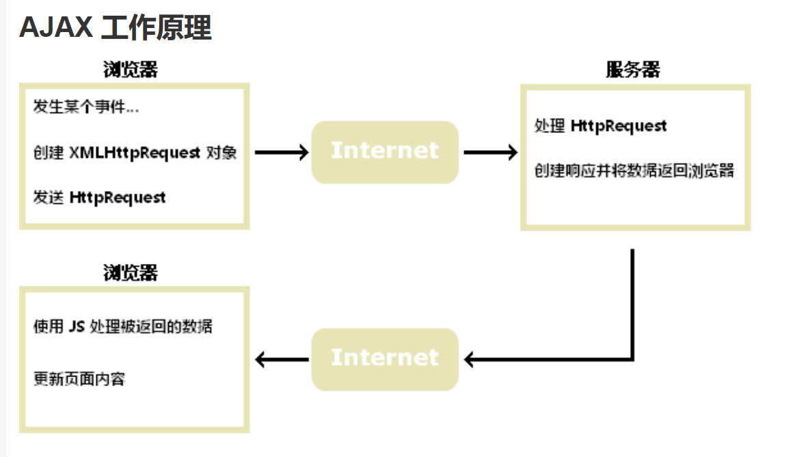

 

### axios

  axios在ajax功能的基础上更加简介，方便。可以处理各种类型的请求（GET、POST、PUT 等），并支持拦截器、取消请求、处理请求错误等功能

 

### NPM

node package manger，通过npm，您可以方便地搜索、安装和管理各种JavaScript软件包和库。一个提供js外部库的工具

 

## tomcat

tomcat是Servlet容器，可以管理Servlet、Filter、Listerner这样的组件，可以创建Servlet对象、初始化操作、处理请求、销毁操作等。不仅可以存储对象，并且可以管理、调用对象的方法等

 

## 注解：

注解是一种标识，相比于注释，注释是给人看的，而注解是给程序看的。

- 定义注解可以使用原注解**==@Target==**指定注解的使用范围：类、属性、方法、参数、构造器、包、构造器
- 使用**==@Retention==**指定注解的保留域：SOURCE编译环境中、CLASS类中，runtime运行时
- 注解是一个标注，使用一般搭配反射，比如定义一个注解标注某个方法，表示需要在程序运行的某个阶段使用这些有这个注解的方法，就可以通过反射获取有这个注解的方法，再去调用·
  
  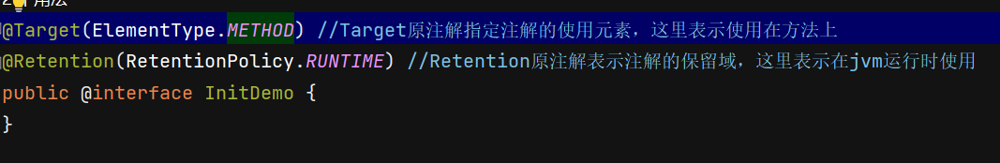
  
  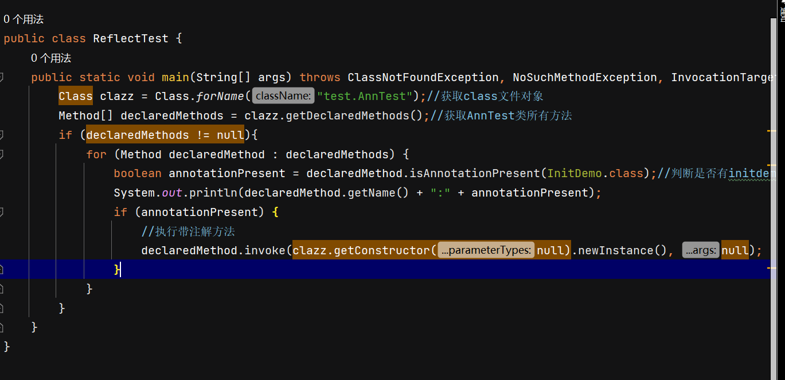

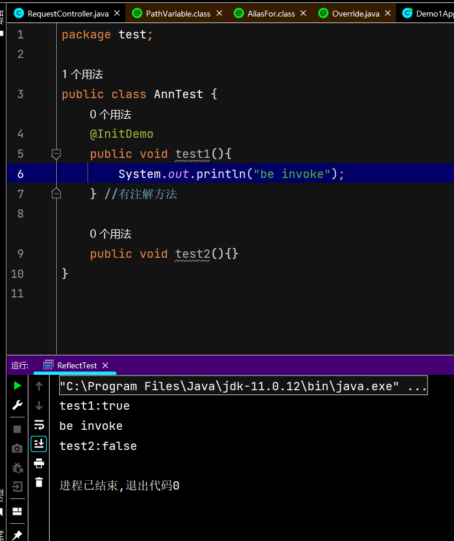

 

## maven

通过建立依赖管理jar包

依赖范围

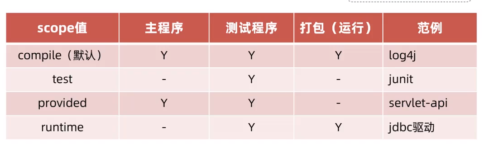

 

# web三层架构

复用性强、便于维护、利于拓展

- **controller控制层**：接收请求，响应数据
- **service业务逻辑层**：业务逻辑处理
- **dao数据访问层**：数据访问，获取底层数据

 

## spring核心思想

分层解耦：防止因为一个类的改变，而影响其它有依赖的类的改变

- Bean对象：IOC容器中创建、管理的对象
- IOC 控制反转：对象的创建控制权由程序自身转移到外部（容器） 
  > @Component：表示将当前类交给IOC容器，成为IOC容器的Bean
  > 
  > 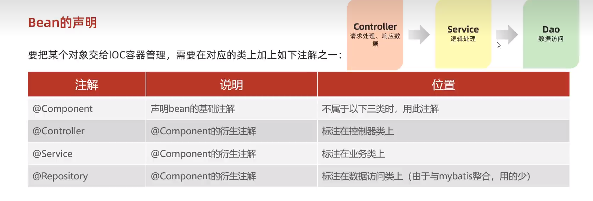
- DI 依赖注入：容器为应用程序提供运行时所依赖的资源 
  > @Autowired：运行时，IOC容器会创建一个该类型的bean对象，并赋值给该对象

 

## 数据库连接池

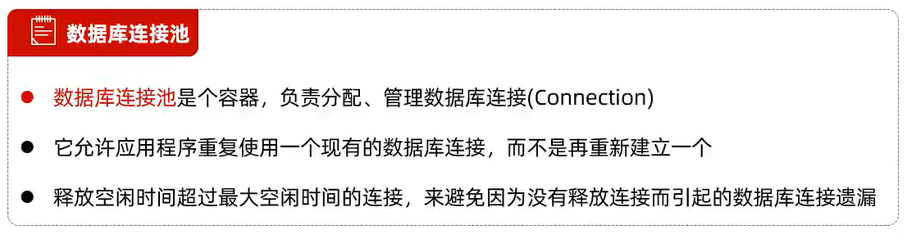

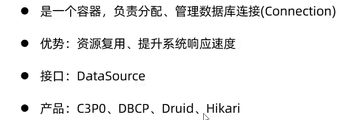

 

### lombok

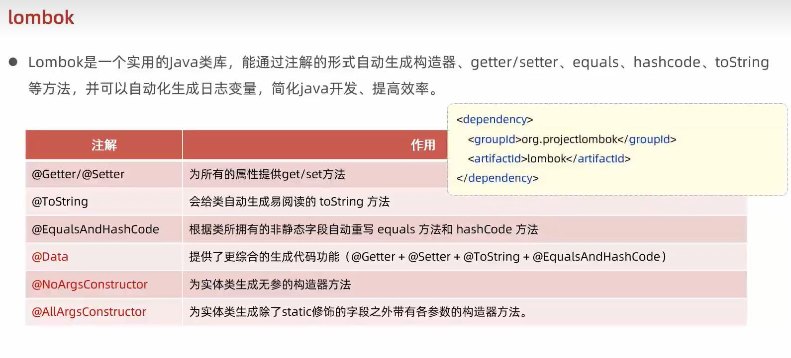

@Slf4j：为当前的类提供一个log日志对象

 

## PageHelper分页插件

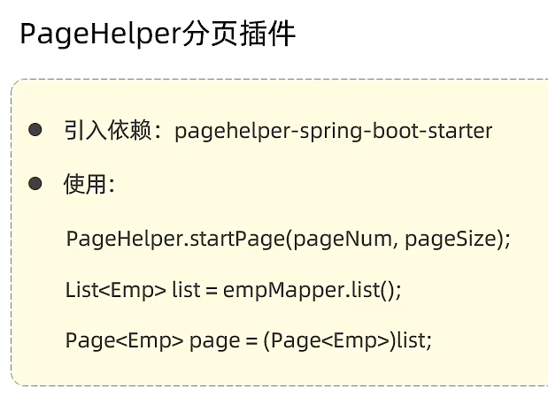

只需要编写查找全表的sql语句（empMapper.list()），通过pageNum,pageSize参数来自动对sql语句进行改变（添加litmit），实现分页查询。

 

### 文件上传

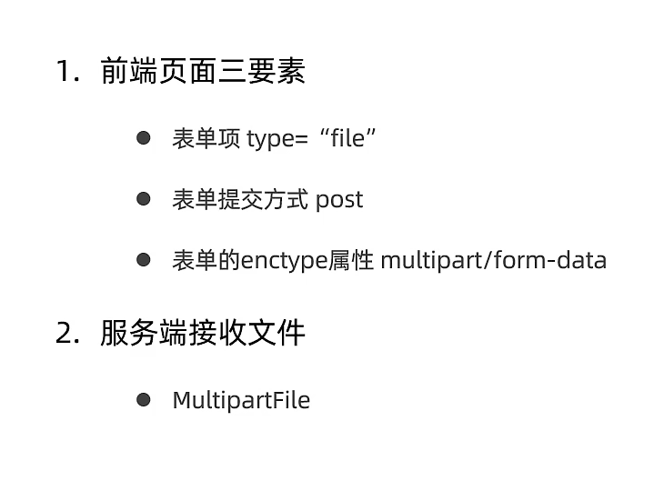

！服务端接收到的文件都是临时文件，当服务关闭就会被删除；

为了防止相同文件名导致文件覆盖丢失，一般使用UUID重命名文件；

MUlitipartFile中可以使用transferTo()方法指定路径转存临时文件，保存在本地中；

**文件大小限制导致上传失败问题**

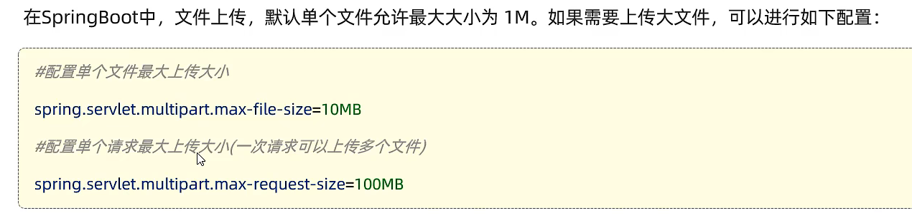

 

## 会话跟踪方案

传统方案

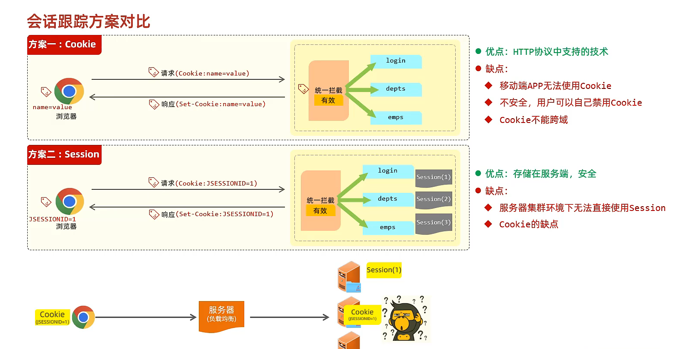

主流方案

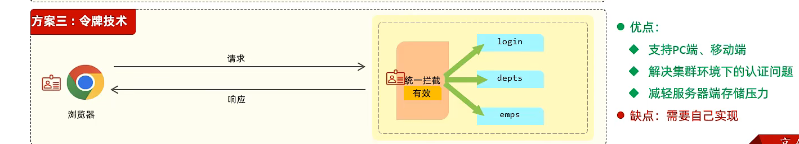

 

### JWT令牌

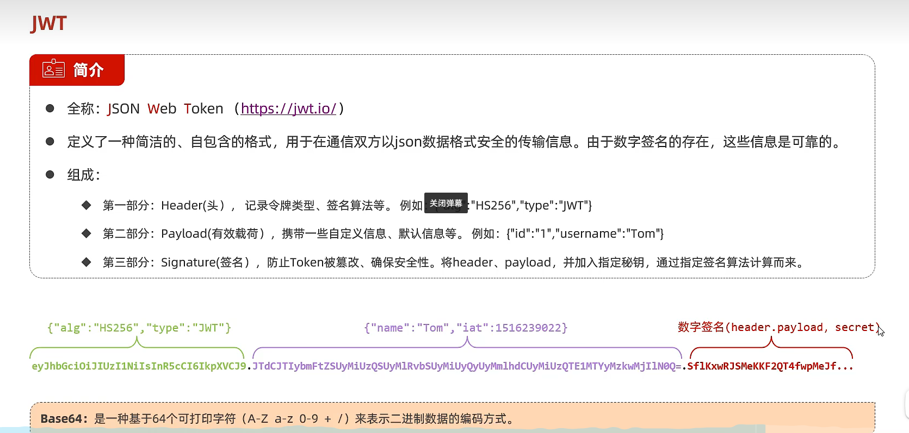

jwt令牌的第三部分签名，是由第一、二部分加密钥的组成再编码而成，可以判断信息是否被更改

### 令牌的实现思路：

1.令牌生成：登陆成功后，生成jwt令牌，并返回给前端

2.令牌校验：在请求到达服务端后，对令牌进行统一拦截、校验

 

 

 

## 登陆校验：过滤器filter

每次访问路径都要判断登陆状态，如果在每个路径上都添加登陆校验的代码就会非常麻烦，使用过滤器filter可以实现这个功能

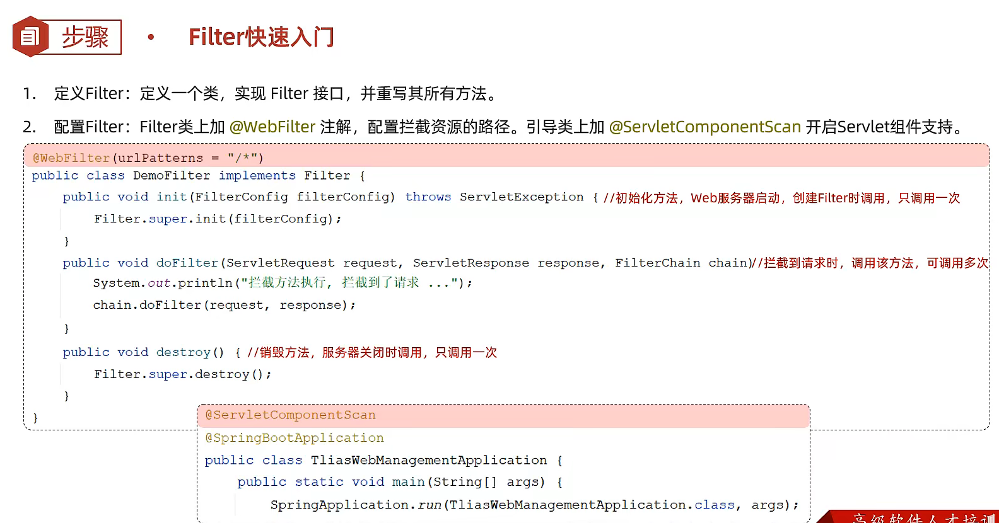

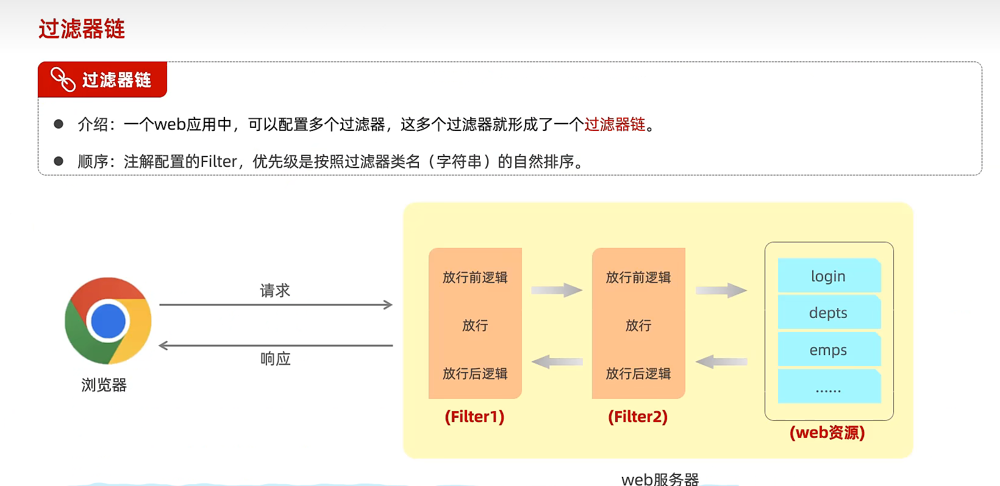

 

 

 

## 登陆校验：拦截器Interceptor

功能类似过滤器filter，不同的是拦截器Interceptor属于spring的机制

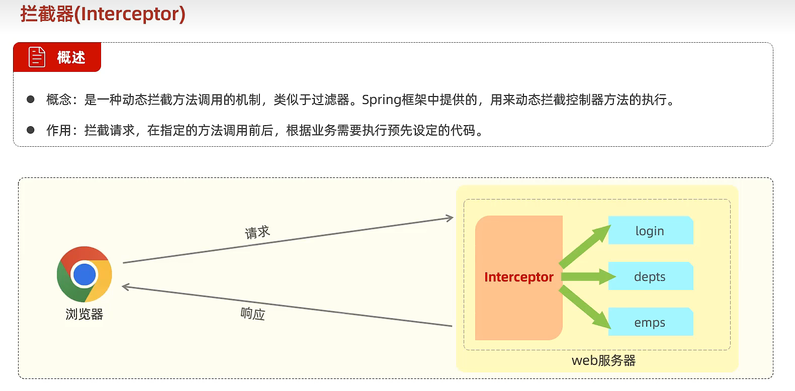

1.定义拦截器

2.配置拦截器

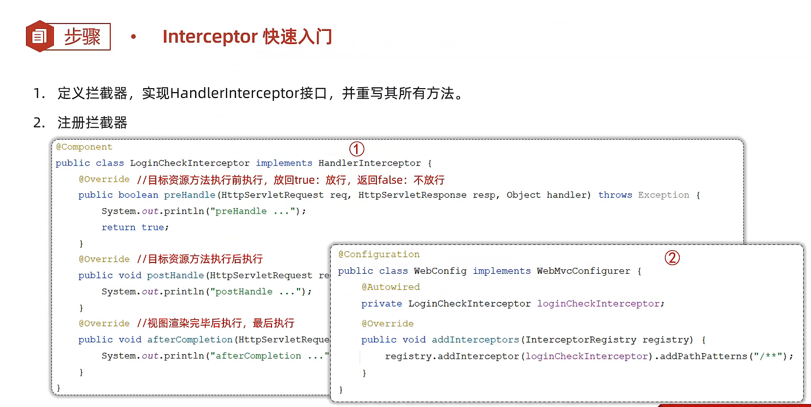

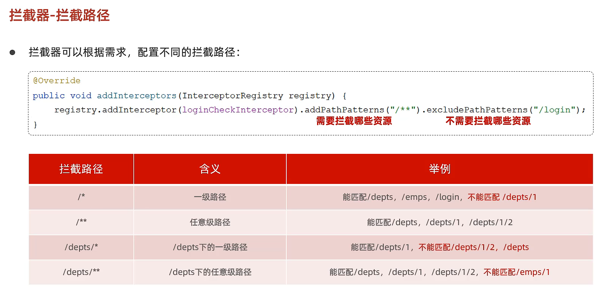

 

 

 

### 拦截器和过滤器的维度

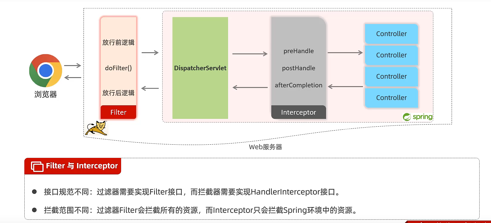

 

 

 

## 全局异常处理器

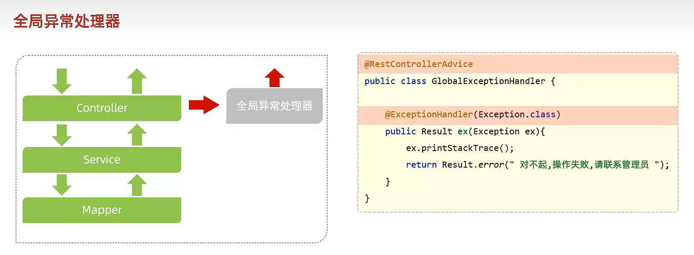

 

 

## AOP面向切面编程

又叫面向方法编程，可以对一系列的方法进行功能增强，添加业务，又无需对原方法进行侵入式改变

**原理：动态代理**

特点：- 代码无侵入     - 减少重复代码     - 提高开发效率     - 维护方便

 

springAOP：是spring框架的高级技术，旨在管理bean对象的过程中，主要通过底层的动态代理机制，对特定的方法进行编程。

 

 

# web总结

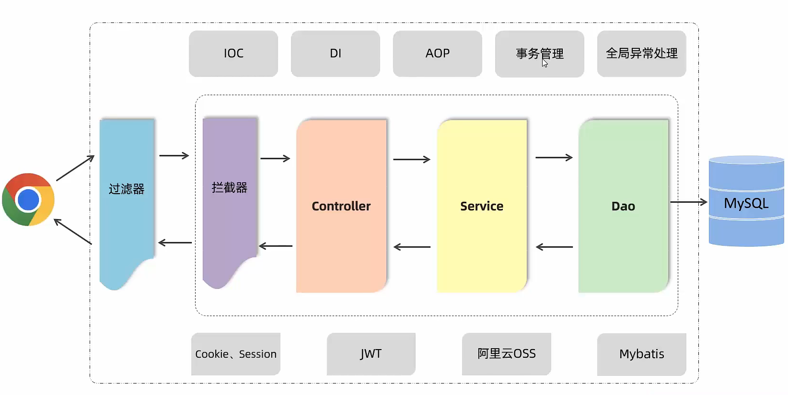

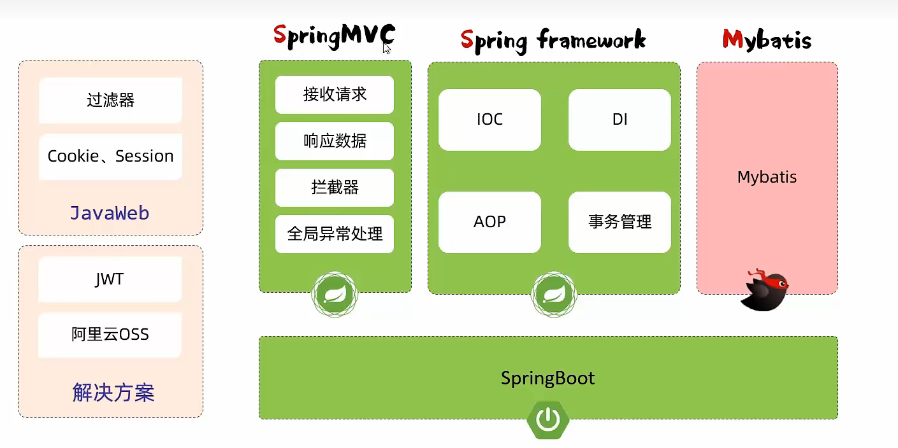
