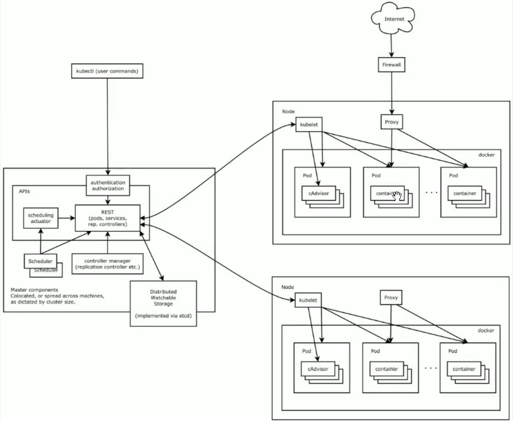
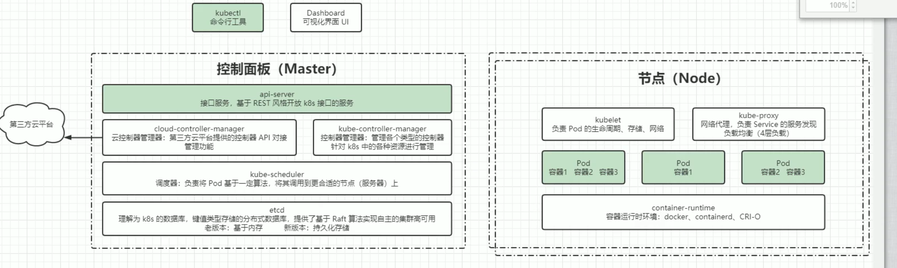
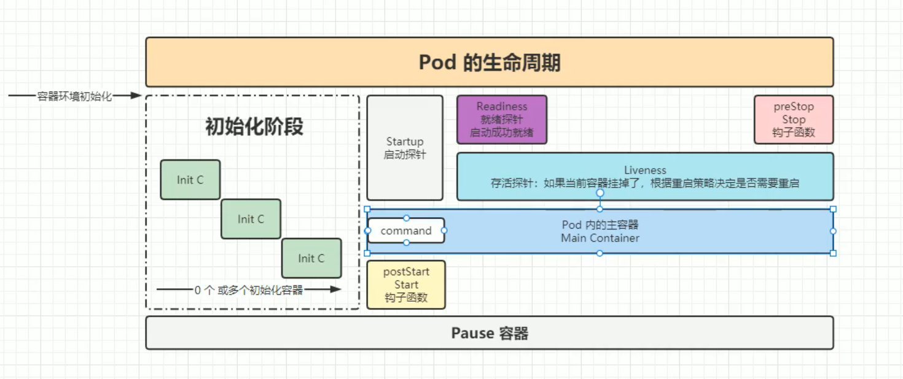
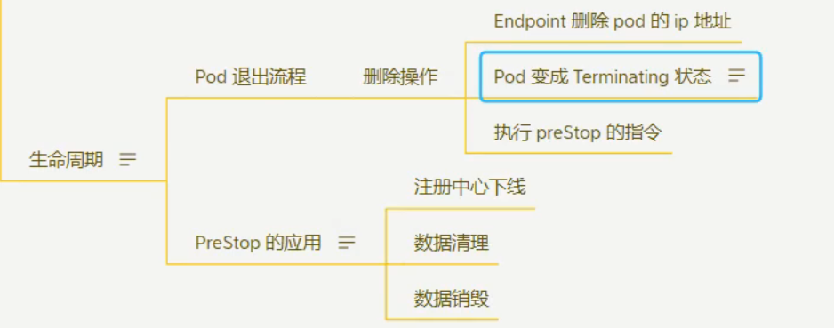
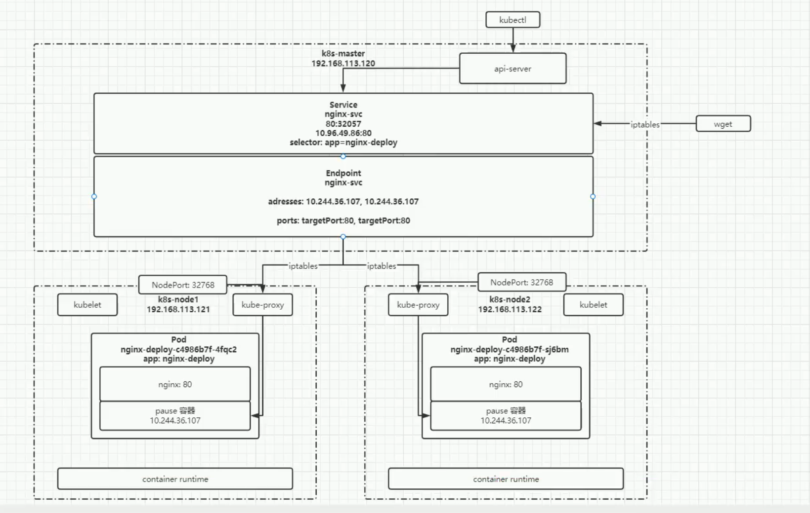
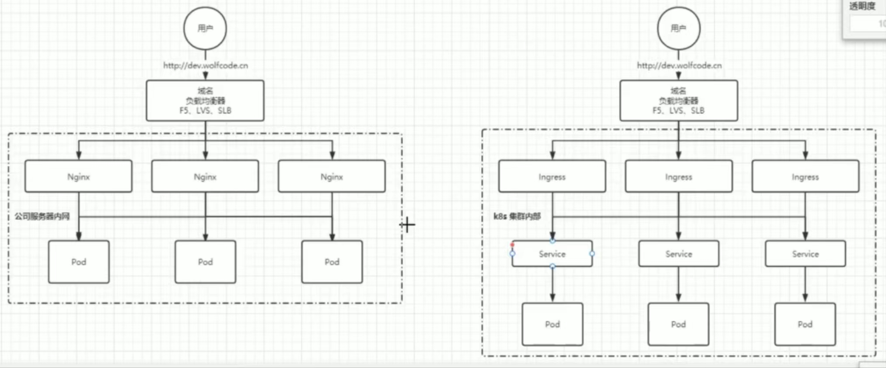

# k8s

[TOC]

## k8s架构

有一个主节点，主节点（Master）可以管理多个从节点（Node），使用k8s即使用主节点提供的apis通过请求的方式管理各节点

## 有状态和无状态

有状态：依赖环境，文件存储，硬件依赖等

无状态：运行不需要依赖环境

## 资源和对象

资源：k8s中所有内容都被抽象成“资源”，如pod，node，service等

对象：某个持久化的实体。

对象是资源的实例，相当于类和对象

## 对象规约和状态

规约spec：描述对象的期望状态

状态status：k8s维护的对象的实际状态，对象通过k8s的管理，让实际状态尽量向期望状态重合

## 资源对象的分类

作用域：元数据型、集群级、命名空间级

### 命名空间级：

#### pod（容器组）：

k8s中最小的可部署单元，一个Pod(容器组)包含了一个应用程序容器（某些情况下是多个容器)、存储资源、一个谁一的网络P地址、以及一些确定容器该如何运行的选项。Pod容器组代表了Kubernetes中一个独立的应用程序运行实例，该实例可能由单个容器或者几个紧籍合在一起的容器组成。

Docker是Kubernetes Pod中使用最广泛的容器引擎：Kubernetes Pod同时也支持其他类型的容器引擎

一般情况下一个pod运行一个容器（方便管理）；在紧密耦合、资源共享的多个容器也可以排在一个pod里

**副本（replicas）**：一个pod可以被复制成多份，每一份称之为一个“副本”，除了pod的标识性信息不一样，其它都是一样的

**控制器**：

无状态服务：
rc
rs
deployment：对pod的副本管理，包括动态扩容和缩容pod；滚动升级/回滚等

适用有状态服务：
StatefulSet： 特点有序、稳定
		Headless Service：对于有状态服务的DNS管理
		volumeClaimTemplate：用于创建特久化卷的模板

层级关系：deployment:rs:pod

# 深入pod

## 创建pod 资源清单

创建pod就是以yaml文件的描述创建pod

必须属性

|属性|解释|
| ---- | ---- |
|apiVersion(String)|k8s api的版本，目前基本是V1，可以使用kubectl api-versions命令查询|
|kind(String)|yaml文件定义的资源类型和角色，，比如Pod|
|metadata(Object)|元数据对象，固定值就写metadata|
|metadata.name(String)|元数据对象的名字，由我们编写，如定义Pod的名字|
|metadata.namespace|元数据对象的命名空间，由我们自身定义|
|Spec(Object)|详细定义对象，固定值就写Spec|
|spec.containers|Spec对象的容器列表定义，是个列表|
|spec.containers[].name(String)|定义容器的名字|
|spec.containers[].image(String)|容器用到的镜像名称|

主要的属性
|属性|解释|
| ---- | ---- |
|spec.containers[].name(String)|容器的名称|
|spec.containers[].imagePullPolicy(String)|定义镜像拉取策略，有Always（每次都尝试重新拉取镜像）、Never（仅使用本地镜像）、IfNotPresent（如果本地有镜像就使用本地镜像，没有则拉取镜像）三个值可选，默认是Always|
|spec.containers[].command|指定容器启动命令，因为是数组可以指定多个，不指定则使用镜像打包时使用的启动命令|
|spec.containers[].args|指定容器启动命令参数，因为是数组可以指定多个|
|spec.containers[].workingDir(String)|指定容器的工作目录|
|spec.containers[].volumeMounts|指定容器内部的存储卷配置|
|spec.containers[].volumeMounts[].name(String)|指定被容器挂载的存储卷的名称|
|spec.containers[].volumeMounts[].mountPath(String)|指定被容器挂载的存储卷的路径|
|spec.containers[].volumeMounts[].readOnly(String)|设置存储卷路径的读写模式，true或者false，默认为读写模式|
|spec.containers[].ports|指定容器需要用到的端口列表|
|spec.containers[].ports[].name(String)|指定端口名称|
|spec.containers[].ports[].containerPort(String)|指定容器需要监听的端口号|
|spec.containers[].ports[].hostPort(String)|指定容器所在主机需要监听的端口号，默认跟containerPort相同，注意设置了hostPort，同一台主机无法启动该容器的相同副本（因为主机的端口号不能相同，会冲突）|
|spec.containers[].ports[].protocol(String)|指定端口协议，支持TCP和UDP,默认值是TCP|
|spec.containers[].env|指定容器运行前需要设置的环境变量列表|
|spec.containers[].env[].name(String)|指定环境变量名称|
|spec.containers[].env[].value(String)|指定环境变量值|
|spec.containers[].resources(Object)|指定资源限制和资源请求的值|
|spec.containers[].resources.limits(Object)|指定设置容器运行时资源的运行上限|
|spec.containers[].resources.limits.cpu(String)|指定cpu的限制，单位为core数，将用于docker run --cpu-shares参数|
|spec.containers[].resources.limits.memory(String)|指定mem内存的限制|
|spec.containers[].resources.requests(Object)|指定容器启动和调度时的限制设置|
|spec.containers[].resources.requests.cpu(String)|cpu请求，单位为core数，容器启动时初始化可用数量|
|spec.containers[].resources.requests.memory(String)|内存请求，容器启动的初始化可用数量|

额外属性
|属性|解释|
| ---- | ---- |
|spec.restartPolicy(String)|定义Pod的重启策略，可选值为Always(Pod一旦终止运行，则无论容器是如何终止的，kubelet服务都将重启它)、OnFailure(只有Pod以非零码终止时，kubelet才会重启该容器，如果是正常结束，退出码为0，则kubelet将不会重启它)、Never(Pod终止后，kubelet将退出码报告给master，不会重启该Pod)|
|spec.nodeSelector(Object)|定义Node的Label过滤标签，以keyvalue格式指定|
|spec.imagePullSecrets(Object)|定义pull镜像时使用secret名称，以namesecretkey格式指定|
|spec.hostNetwork(Boolean)|定义是否使用主机网络模式，默认值为false，设置true表示使用宿主机网络，不使用docker网桥，同时设置了true将无法在同一台宿主机上启动第二个副本|

## 探针

对容器异常的管理

类型

- StartupProbe：探测引用程序是否已经启动，会禁用下面两个探针，以确保任务在首次已成功启用，之后才开启其它探针
- LivenessProbe：检测容器是否异常退出，对该应用进行重启或其它操作
- ReadinessProbe：检测容器是否完全启动，完全启动后允许外部访问

探测方式

- ExecAction：命令探测
- TCPSocketAction：Tcp探测
- HTTPGetAction：http请求探测

## Pod生命周期

# 资源调度

## 标签和选择器

matedata.label标签下自定义属性

使用label中的属性可以找到该资源

## 滚动更新和回滚

通过更改deployment控制器的yaml模板对pod进行更新

自动更新开启和停止

## DaemonSet：守护进程

为daemonset选择某标签后，该pod将会成为拥有某标签的节点的守护进程

## 存储管理

- HostPath：持久化存储目录，将节点上的文件或目录挂载到Pod上，删除Pod不会导致内容消失
- EmptyDir：把Pod文件或目录挂载到容器内，可以实现Pod的不同容器的文件共享，随者Pod消失而消失

## ConfigMap配置管理

# 服务发现

## Service

pod、容器间相互访问

## Ingress

外部网络和k8s内部网络的连接

传统网络配置和ingress网络配置图解：

