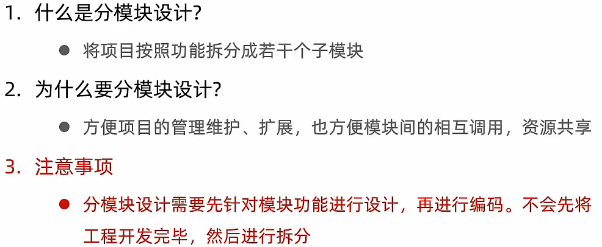
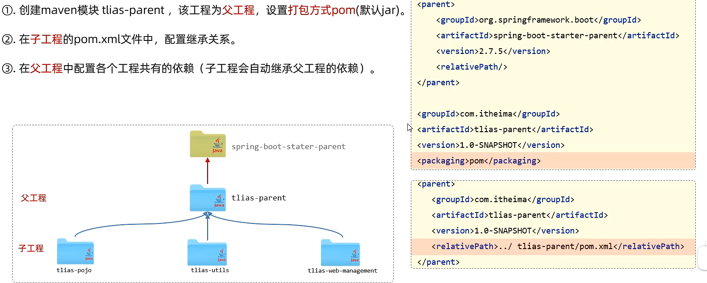
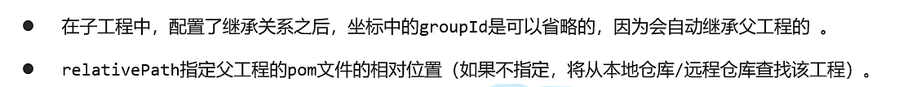
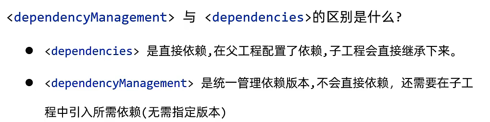
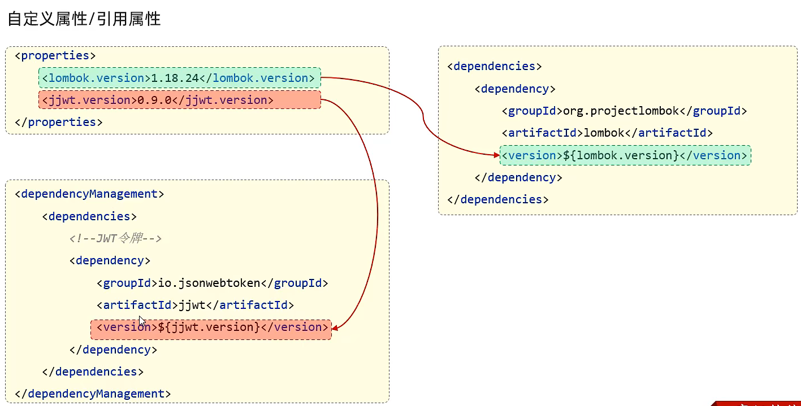
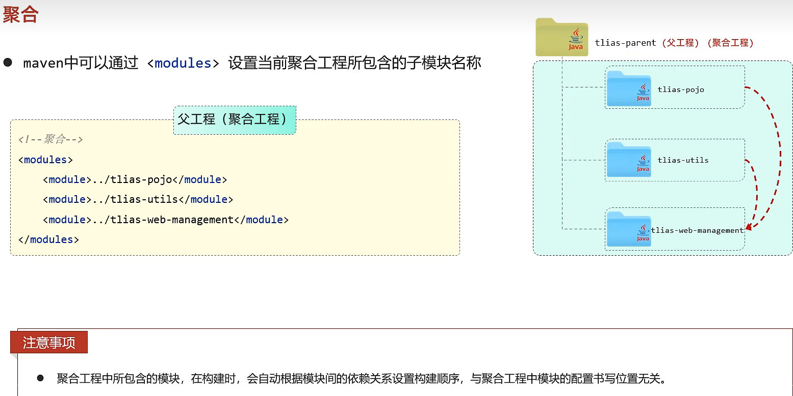
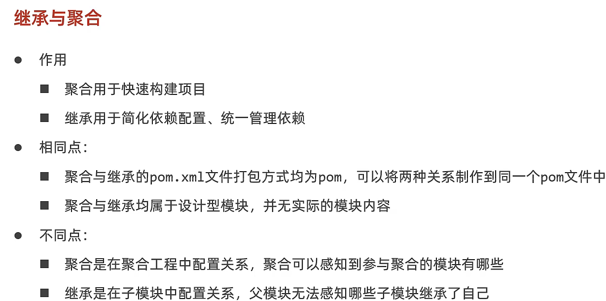

# maven

## 分模块设计

 

## 继承

	问题：使用分模块设计，每个模块都需要引入当前模块需要的依赖，如果每个模块都需要某些依赖，那么每个模块都要重复的引入这些依赖，就会很繁琐
	
	解决：使用maven的继承，继承是单继承，创建一个父工程，打包方式为pom（只需要引入依赖），父工程引入子工程重复使用的模块。

- 继承关系

	在springboot项目中，当前项目的父工程还需要继承springboot的父工程

- 版本锁定
  
  在父工程中使用<dependencyManagement>对子工程的依赖进行依赖管理
  
  为了方便维护和更新依赖版本，可以在<properties>中自定义标签来记录版本号，在依赖引入上的版本号位置使用${...}来插入版本号
  
  

 

## 聚合

在父工程（聚合工程）中绑定子工程，当需要子工程需要进行maven批量操作时（clean，package，install等），直接在聚合工程中进行，就可以对绑定的所有子工程进行操作。

 

 

## 继承与聚合

