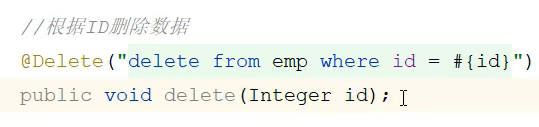
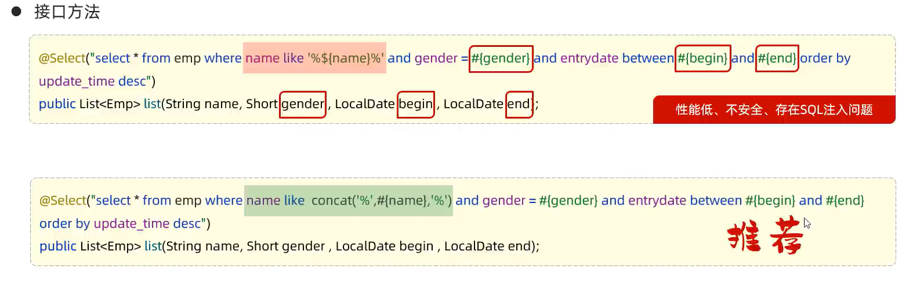
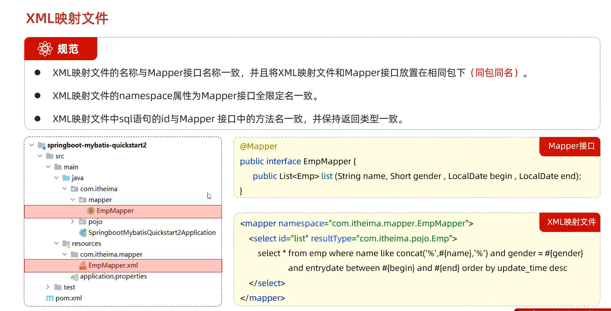
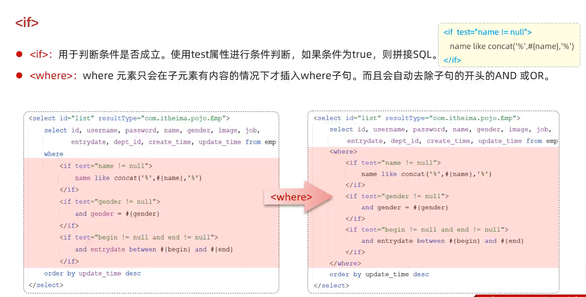
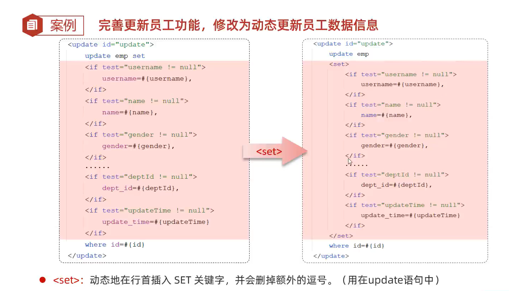
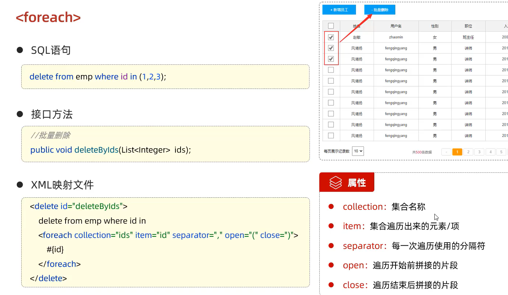
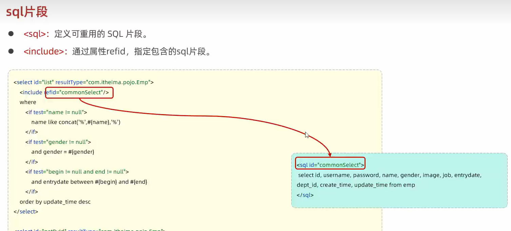
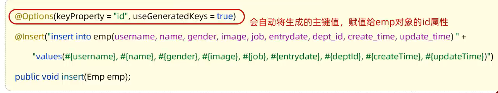

## 注解

@Mapper：运行时，会自动生成该接口的实现类对象（代理对象），并交给IOC容器管理

@Select

@Insert

@Options(useGeneratedKeys = true, keyProperty = "<field>")：useGeneratedKeys 表示使用数据库生成的主键，keyProperty指定接收主键值的属性

@Param：给mapper方法的参数命名，使用情况：1.mapper方法需要给sql语句传入多个参数； 2.@Param注解javaBean对象
在**不使用**@Param注解声明参数的时候，mapper方法传参只能传一个值或对象，且必须使用的是#{}方式来取参数。

 

---

 

- #{parameter}：在sql语句中传递参数，执行sql时，会被替换为？占位符，不存在sql注入问题，在传递参数时都可以使用

- ${field}：拼接sql。直接将参数拼接在sql语句中，**存在sql注入问题**，一般对表名、列表进行动态设置时可以使用，使用较少

 

- 当需要模糊查询时 like ='%<>%'，不能使用#{}的形式传入参数，因为此时'%?%'是字符串类型的，占位符不起作用。需要使用concat函数用来拼接字符串

 

- 使用mabatis来管理sql语句，不仅可以使用注解，还可以使用XML映射文件来绑定sql语句。注解和XML映射文件都是有效方法，一般对于简单的sql语句使用注解，对于复杂的sql使用XML可以更好的管理sql语句。注解有的属性，在XML标签中都有相同的属性，比如useGeneratedKeys，keyProperty等

 

## 动态SQL

- <if> & <where>

- <set>

- <foreach>

- <sql> & <include>

## 一些没有见过的写法

获取emp对象的属性竟然不用emp.get属性。

这里是自动调用了这个属性的get方法

