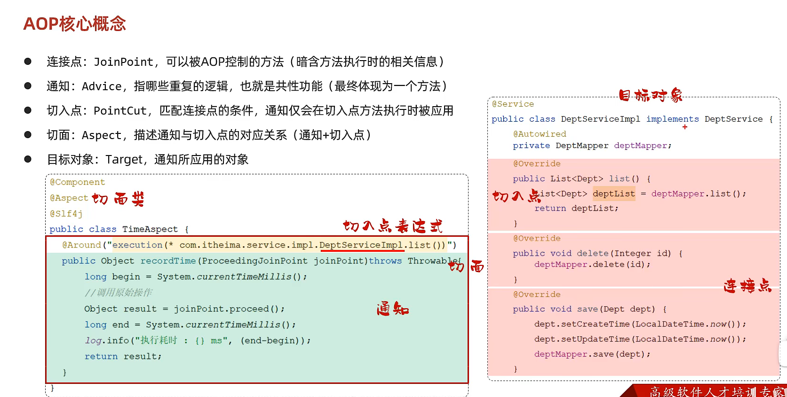
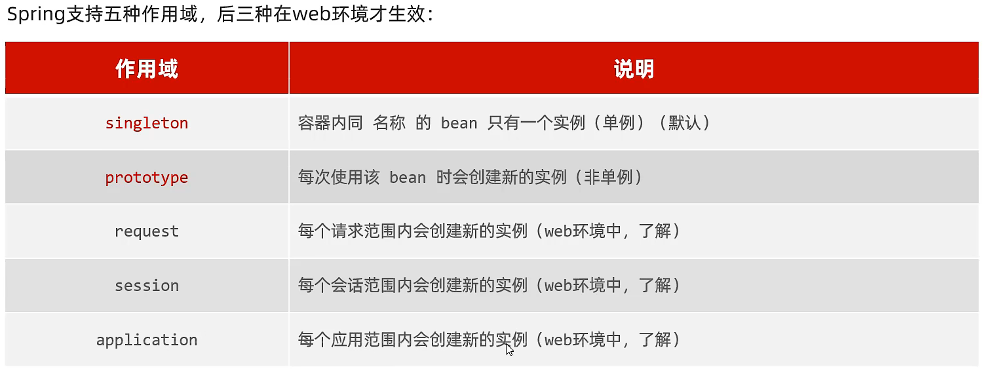

## IOC反转控制相关

- @Bean：声明基础bean，一般用于第三方bean
- @Component：声明基础bean注解，一般用于自定义bean
- @Controller：声明控制器类注解
- @Service：声明业务逻辑类注解
- @Repository：声明数据访问类注解
- @ComponentScan： 可以改变注解扫描的范围
- @Import：使用@Import导入的类会被spring加载到IOC容器中，支持普通类、配置类、ImportSelector接口实现类
- @EnableXxxx：封装了@Import注解
- @SpirngBootApplication：springboot程序主入口，具有包扫描作用，默认扫描当前包及其子包
- @Scope：配置bean的作用域
- @Lazy：延迟bean初始化（第一次使用时）
- @ConditionalOnClass：注入条件
- @ConditionalOnMissingBean：注入条件
- @ConditionalOnProperty：注入条件

<br/>

## DI依赖注入相关

- @Autowired：运行时，IOC容器会创建一个该类型的bean对象，并赋值给该对象，** 按照类型注入**

如果种类型的bean存在多个，可以采取以下方案

1. @Primary：在想要的反转的类型上加上此注解，表示控制反转该类型
2. @Autowired + @Qualifier("bean的名称”）
3. @Resource(name = "bean的名称")：该注解不加属性是**按照类型注入**，加属性是**按照名称注入**

<br/>

## 注解

- @SpringBootTest：springboot整合端元测试的注解
- @Test：表示测试方法
- @RequestMapping：请求路径映射，指定请求类型method属性，可以作用在类上，提取路径，表示这个类的请求路径都在这个路径之下
  > 指定请求路径注释
  > 
  > 
- @PathVariable：获取请求路径中的参数
- @RequestBody：将从前端收到的json格式数据封装成实体类
- @ResponseBody：将实体类封装成json格式
- @RequestParam：接收请求的参数，defaultValue属性可以设置当参数为空时的默认值
- @DateTimeFormat：表示接收时间参数，pattern属性指定时间格式
- @Value("${name}")：从配置文件中为属性注入值（单个）
- @ConfigurationProperties：可以批量的将外部的属性配置注入到bean对象的属性中（批量）
- @RestControllerAdvice：全局异常处理器类
- @ExceptionHandler(Exception.class)：在全局异常处理器中表示指定异常的处理方法
- @Transactional：表示以下的操作为事务操作，一旦有异常将会回滚操作。一般情况下只有抛出了RunTimeException异常才会回滚异常；**rollbackFor**属性用于控制出现何种异常类型才回滚事务；**propagation**属性事务传播行为，当事务方法中调用事务方法，调用的方法是加入事务一起回滚或提交，还是挂起事务新创建一个事务。
- @Configuration：配置类
- @Aspect：定义一个AOP切面类
- @Around("execution( )")：aop通知的一种类型
- @PointCut：切入点，作用是将公共的切点表达式抽取出来，需要用到时引用该切点表达式即可
- @Order(<num>)：可以在切面类上控制顺序

<br/>

<br/>

<br/>

<br/>

---

## springboot相关

### 类

- MultipartFile：多部分文件，用来接收前端发来的文件类型
- JoinPoint：获取代理类和被代理类的信息
- ProceedingJoinPoint：继承了JoinPoint，在此基础上暴露出proceed方法，用于启用目标方法的执行，支持around这种切面类型

<br/>

<br/>

### 接口

- HandlerInterceptor：拦截器接口
- WebMvcConfigurer： WebMvcConfigurer配置类其实是Spring内部的一种配置方式，采用JavaBean的形式来代替传统的xml配置文件形式进行针对框架个性化定制，可以自定义一些Handler，Interceptor，ViewResolver，MessageConverter。

<br/>

### 配置文件

- yml/yaml：格式简介，层级清晰

<br/>

### 自定义starter

	starter由两部分组成：1.依赖管理：需要引入的依赖    2.自动配置：往bean中注入依赖

	并且依赖管理需要包含自动配置部分，只需引入依赖管理部分就可以由自动配置部分全部引入


<br/>

# AOP核心概念



- ### 通知类型


- ### <u>通知顺序</u>

当有多个切面的切入点都匹配到了目标方法，目标方法运行时，多个通知方法都会被执行


- ### <u>切入点表达式</u>

1. 

通配符：* 表示一个（一级）；.. 表示多个（多级）*


2. 

对于有特殊需求的，比如方法命名不规范，需要代理的方法散乱，使用excution会比较繁琐，可以使用@annotation切入点表达式，需要自定义一个注释，并在需要代理的方法上添加这个注释  

@annotation定位注释全类名


<br/>

- ### <u>连接点</u>

类ProceedingJoinPoint是JoinPoint的子类，暴露了proceed方法，为了在环绕通知中控制原方法的调用


<br/>

***

<br/>

# springboot原理

<br/>

## 配置方式及优先级

```
系统命令行参数配置 -> java系统配置 -> application.properties -> application.yml（高 -> 低）
```

<br/>

## bean管理

- #### bean的获取
  
    


- #### bean作用域
  
    通过@Scope注解来设置bean作用域，默认单例




- #### 第三方bean
  
    在第三方源码中，不可以更改源码，也就无法在源码中添加@Component注解把对象交给IOC容器，此时可以自定义一个方法，这个方法返回一个第三方对象，然后再该对象上添加@Bean注解，把方法返回值交给IOC容器管理，成为bean对象 一般这些用于创建第三方bean对象的方法都放在一个@configuration类上


<br/>

## 启步依赖

	在传统spring项目中，项目的依赖和配置都是非常繁琐的，要引入很多依赖，在springboot中，引入一个依赖就会通过==maven的依赖传递==把这个依赖的所有依赖都引入进来，并且保证版本对应，简化了传统spring中的引入依赖

<br/>

## 自动配置

	SpringBoot的自动配置就是当spring容器启动后，一些配置类、bean对象就自动存入到了IOC容器中，不需要我们手动去声明，从而简化了开发，省去了繁琐的配置操作。

- ### 自动配置原理

	方案一：@ComponentScan注解

	方案二：@Import、@EnableXxxx

- ### 源码跟踪

	源码入口==@SpringBootApplication==

									==↓==

	@SpringBootConfiguration：该注解和@Configuration相同，声明当前是一个配置类

	@ComponentScan

	==@EnableAutoConfiguration==：SpringBoot实现自动化配置的核心注解

						==↓==

	@Import：==ImportSelector接口实现类==

								   	==↓==

	实现了==String[] selectImports(...)==方法：返回的是需要导入的类的全类名

												==↓==

	配置文件：2.7版本后使用==.AutoConfiguration.import==文件，旧版使用==spring.factories==文件

- ### 注入条件

