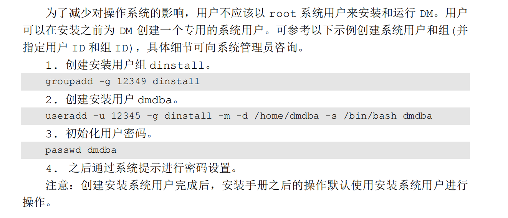
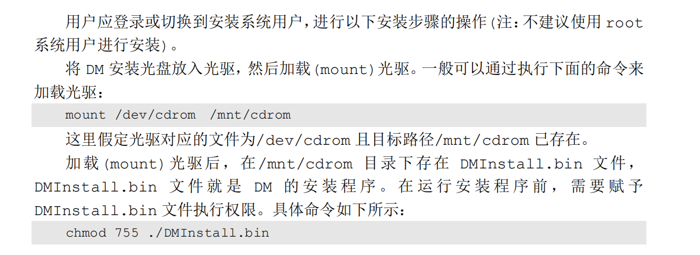

## 创建安装用户

更新yum源
curl -o /etc/yum.repos.d/CentOS-Base.repo http://mirrors.aliyun.com/repo/Centos-7.repo

下载linux工具
yum install util-linux

创建loop块设备
mknod /dev/loop0 b 7 0

挂载iso文件
mount -o loop dm8_20240322_x86_rh6_64.iso /mnt/cdrom/

安装

运行命令行工具disql
cd /home/dmdba/dmdbms/tool
./disql