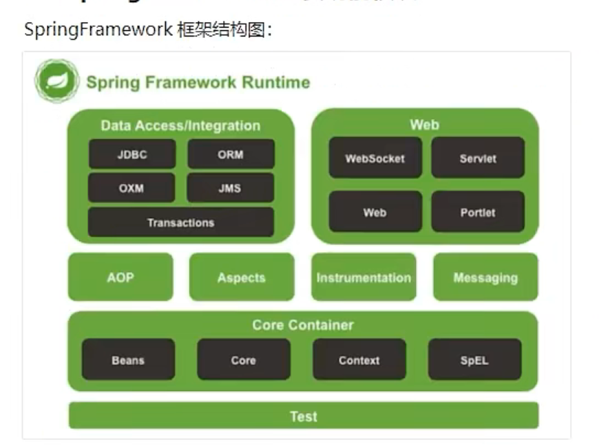
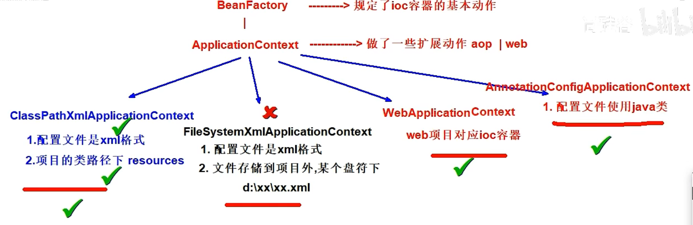
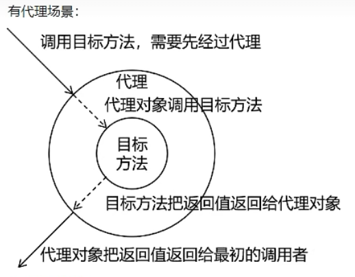
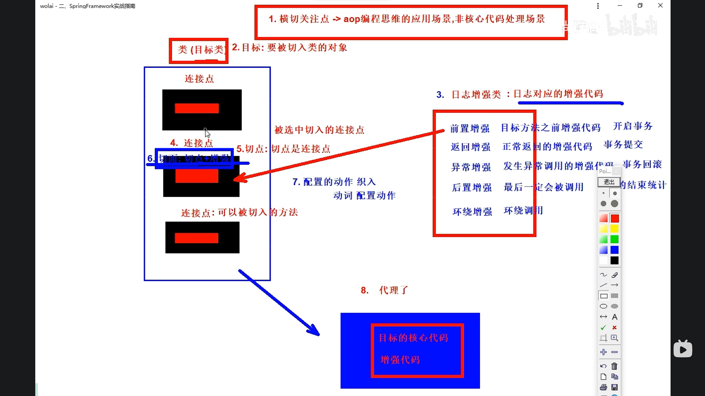
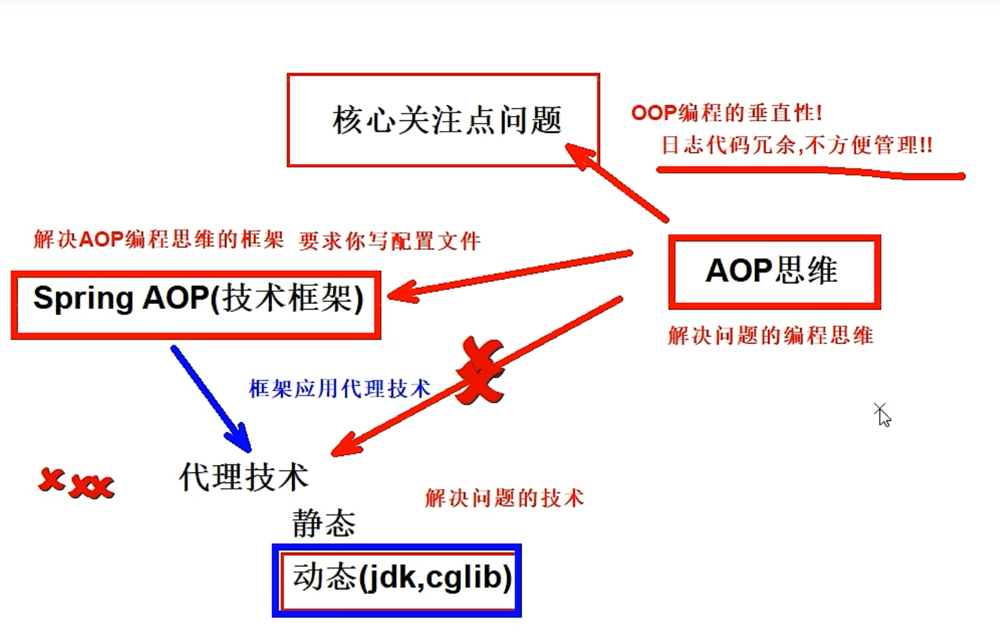
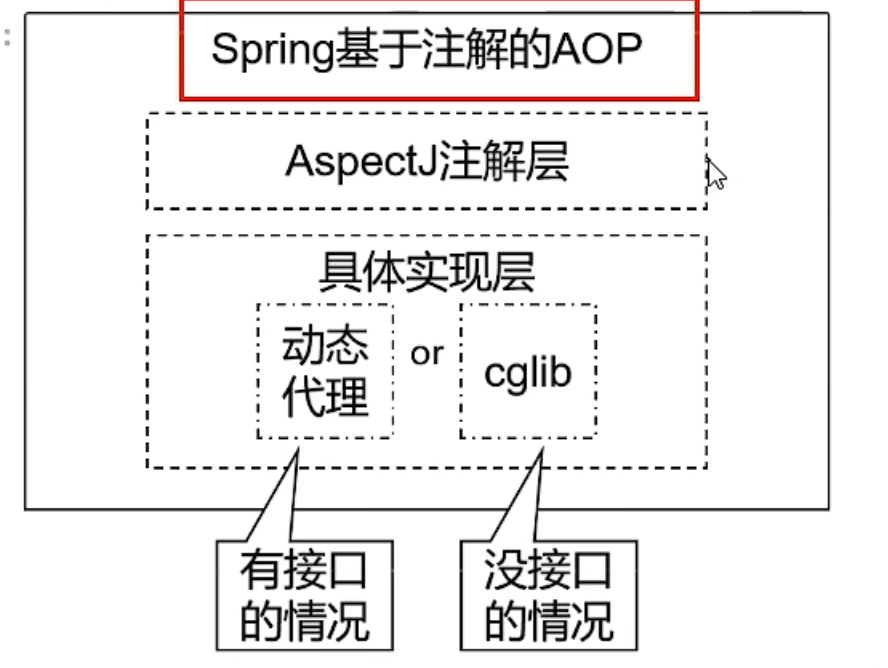

# Spring framework

## 需要了解的一些名词

单一架构：一个项目，一个工程，导出为war包，在一个tomcat上运行

单一架构，项目主要应用技术框架为：Spring，SpringMVC，Mybatis

<br/>

分布式架构：一个项目拆分成了很多个模块，每一个工程都是运行在自己的tomcat上。模块之间可以互相调用，。每个模块内部可以看成是一个单一架构的应用.

项目主要应用技术框架：SpringBoot（SSM），SpringCloud，中间件等 

<br/>

组件：可以复用的java对象

组件一定是对象，对象不一定是组件

组件一般是在程序中有业务功能的，而非组件一般没有

<br/>

## SpringFramework

 是Spring家族的基础

SpringFramework主要功能模块



<br/>

## IOC容器

### ioc容器继承关系



<br/>

<br/>

### IOC控制反转

控制反转：控制反转是针对对象的创建和调用控制而言的，对象的管理从程序员变成IOC容器，由IOC容器维护、管理对象

<br/>

<br/>

### DI依赖注入

在组件之间的传递依赖关系的过程中，将依赖关系在容器内部进行处理，这样就不必再应用程序代码中硬编码对象之间的依赖关系，实现了对象之间的解耦合。

它强调将依赖关系从一个对象传递给另一个对象，而不是让一个对象自己创建其依赖关系。在DI中，依赖关系是通过将依赖项注入到对象中而不是对象自己创建它们来实现的.

DI通过XML配置文件或注解方式实现，提供了三种形式的依赖注入：构造函数注入、setter方式注入和接口注入

<br/>

在传统的程序设计中，一个对象通常会负责创建它所依赖的其他对象，或者在需要的时候自己查找和实例化这些依赖项。这样的做法会导致对象之间的紧密耦合，降低了代码的可维护性和可测试性。当一个对象自己创建或查找依赖项时，它需要知道如何创建这些依赖项，这使得代码更加复杂，并且难以修改或扩展。

依赖注入的思想是将对象的依赖关系从对象本身分离出来，由外部的容器或框架负责创建和管理这些依赖项，然后注入（提供）给需要它们的对象。

所谓的依赖关系就是一个对象需要引用另一个对象，比如A对象需要B对象，那么DI就会把B对象实例给A使用

<br/>

### 使用xml方式管理对象

- 配置元数据（配置）
  - 使用xml配置元数据，标示需要ioc容器管理的类
    - 基于无参构造函数实例化组件 
      ```xml
      <bean id="..." class="..." />
      <!--id:组件的唯一标识，方便后期读取 class:组件的类的全限定符-->
      ```
    - 基于静态工厂方法实例化组件
      ```xml
      <bean id="..." class="..." factory-method="..." /> 
      <!--factory-method:指定静态方法 id:静态方法返回的对象的id（创建的组件）-->
      ```
    - 非静态工厂方法实例化组件
      ```xml
      <!--先在ioc容器中实例化工厂类-->
      <bean id="..." class="..." />
      
      <!--通过工厂类对象并指定工厂方法实例化组件-->
      <bean id="..." factory-bean="..." factory-method="..." /> 
      ```
  - di依赖注入，当实例的对象需要引用其它对象时，需要使用di注入依赖的对象
    - 构造函数注入
      
      1.单个构造参数注入
      ```xml
      <!--它们都需要存放在ioc容器中 比如A依赖B-->
      <bean id="Bid" class="B全限定符" />
      
      <bean id="Aid" class="A全限定符">
        <!--构造参数传值 di的配置
          <constructor-arg构造参数传值的di配置
            value =直接属性值 String name ="二狗子" int age = "18"
            ref=引用其他的bean beanId值 -->
        <constructor-arg ref="Bid" />
      </bean>
      ```
      
      2.多个构造参数注入
      ```xml
      <!-- C依赖B, 且C需要参数age和name-->
      <!-- 上面已经把B类放进了IOC容器，这里不再重复写-->
      <bean id="Cid" class="C全限定符">
        <constructor-arg name="name" value="张三" />
        <constructor-arg name="age" value="18" />
        <constructor-arg name="B" ref="Bid" />
      </bean>
      ```
    - 触发setter方法注入
      ```xml
      <!-- D依赖B，D中有属性的setter方法-->
      <bean id="Did" class="D全限定符">
        <!--D中有name属性，需要一个B对象
        有setName和setB方法-->
        <!-- name->属性名 setter方法的去set和首字母小写的值！调用set方法的名
      setMovieFinder -> movieFinder
      value / ref 二选一 value-"直接属性值"ref-"其他bean的Id"-->
        <property name="name" value="张三" />
        <property name="b" ref="Bid" />
      </bean>
      ```
- 实例化ioc容器
  - 使用ClassPathXmlApplicationContext类创建通过指定xml配置获取ioc容器，需要管理的类就会被这个ioc容器自动管理
    ```java
    // 方式一：直接创建容器并指定配置文件（底层还是像方式二那样，需要刷新）
    ApplicationContext applicationContext = new ClassPathXmlApplicationContext("spring-config.xml");
    
    // 方式二：先创建ioc容器对象，再指定配置文件，再刷新。
    // 源码的配置过程，创建容器（spring） 和 配置文件（自己指定）
    ApplicationContext applicationContext = new ClassPathXmlApplicationContext(); //创建对象
    applicationContext.setConfigLocations("spring-config.xml"); //指定配置文件
    applicationContext.refresh(); //调用ioc和di流程
    ```
- 获取bean组件
  - 通过实例化的ioc容器来获取容器中的bean对象
    ```java
    //方案1：直接根据beanId获取 返回值类型是Object 需要强转（不推荐）
    A a = (A)applicationContext.getBean("Aid");
    
    //方案2：根据beanId，同事指定bean的类型Class
    B b = applicationContext.getBean("Bid", B.class);
    
    //方案3：直接根据类型获取
    //根据bean的类型获取，那么同一个类型，在ioc容器中只能有一个bean
    //如果ioc容器中存在多个同类型的bean 会出现：NoUniqueBeanDefinitionException （bean不唯一）
    //ioc的配置一定是实现类，但是可以根据接口类型获取bean 如果C是接口，接口C instanceof ioc容器的类型 == true 判断是否是C的判断实现
    C c = applicationContext.getBean(C.class);
    ```

#### 扩展组件周期方法

```xml
<bean id="Aid" class="A全限定符" init-method="init" destroy-method="destroy" />
<!-- 
    init-method="初始化方法名"
    destroy-method="销毁方法名"
    ioc容器会在对应的时间节点回调对应的方法
-->
<!-- 
    初始化方法必须是public void 无参
    命名随意
-->
```

#### 组件作用域配置（组件实例的创建方式）

*xml的配置信息在程序中是由BeanDefinition对象存储的，每条<bean>标签都有一个对应的BeanDefinition对象并且存储在ioc容器中，当需要创建对象时，ioc容器可以根据BeanDefinition对象来反射创建多个Bean对象实例*

```xml
<bean id="..." class="..." scope="..." />
<!-- 
    scope属性指定改bean的创建方式
    singleton 单例 IOC容器初始化时创建该对象（一个）默认值
    prototype 多例 在需要获取Bean时创建新对象（多个）
-->
```

#### 扩展FactoryBean接口的使用

继承FactoryBean接口就是表示该类是一个工厂类，当需要的对象实例化的过程比较复杂时，使用工厂类可以简化实例的过程，只需要在xml文件中配置工厂类就可以完成一系列的实例过程。FactoryBean多用于第三方框架

```java
public class JavaBeanFactoryBean implements FactoryBean<JavaBean> {
  //重写getObject() 和 getObjectType 方法
  //在getObject方法中写生成JavaBean对象的过程，并返回
}
```

```xml
<bean id="..." class="JavaBeanFactoryBean全限定符"></bean>
<!--
    与非静态工厂方法实例化组件不同
    继承了FactoryBean就无需先把工厂类放进ioc容器，再指定工厂方法
    ioc容器自动实例factorybean工厂并调用getObject方法实例组件
-->
```

<br/>

### 基于注解方式的ioc配置

#### 组件添加标记注解

```java
@Component
@Repository
@Service
@Controller
//没有本质区别，只是在三层架构中方便区分
//组件BeanName问题：默认组件id为类的首字母小写
```

==注解的Value属性可以自定义id == ==默认组件id为类的首字母小写==

#### 配置ioc容器注解扫描范围

1.基本扫描配置

```xml
<context:component-scan base-package="包名" />
<!--
  1.包要精准，提高性能，防止一个包被重复扫描
  2.会扫描指定的包和子包内容
  3，需要配置多个包可以在包名中使用","分隔
-->
```

2.指定排除组件

```xml
<context:component-scan base-package="包名">
  <!-- 指定排除这个包下的Controller组件-->
  <context:exclude-filter type="annotation" expression="org.springframework.stereotype.Controller" />
  <!-- type属性：指定需要排除的类型-->
  <!-- expression属性：指定需要排除的包名-->
</context:component-scan>
```

3.指定扫描组件

<br/>

#### 扩展周期方法

@PostConstruct：初始方法

@PreDestroy：销毁方法

初始方法和销毁方法必须是public void 无参

<br/>

#### 扩展作用域(创建方法）

@Scope(scopeName = ConfigurableBeanFactory.**SCOPE_SINGLETON**)：单例 默认值

@Scope(scopeName = ConfigurableBeanFactory.**SCOPE_PROTOTYPE**)：多例

<br/>

#### 注解di依赖注入

==@Autowired==

场景1：ioc容器中只有一个实现类对象，会正常注入

<br/>

场景2：ioc容器中没有默认的类型对象

```
@Autowired 使用它进行装配，默认情况下要求至少有一个Bean，否则报错，可以指定佛系装配@Autowired(required = flase)，不报错但是不会对属性进行注入
```

<br/>

场景3：用一个类型有多个对应的组件也会报错！无法选择

```
1.用成员属性名匹配组件id，如果有相应的id就会注入

2.@Qualifier(value = "id") 使用该注解指定获取bean的id，不能单独使用必须配合@Autowired

3.@Autowired + @Qualifier(value = "id") = Resource(name = "id")
```

<br/>

==@Value==

该注解一般用于在配置文件中给属性注入值

```xml
<!-- 1.创建配置文件-->
<!-- 2.在xml配置文件中配置需要扫描这个配置文件的信息-->
<context:property-placeholder location="classpath:xx.property" />
```

```java
@Value("${username}")
private String name;
//把配置文件中username的值赋给name属性

@Value("${username:name}");
private String name;
//如果配置文件中没有对应的值，就给这个属性默认值name；
```

<br/>

#### 完全基于注解开发（取代xml配置文件的配置类）

创建ioc配置类

```java
@ComponentScan({"包路径"}) //扫描指定包中的注解配置
@PropertySource(value = "classpath:xx.properties") //导入配置文件
@Configuration //声明一个配置类
public class Configuration {
  
}
```

AnnotationConfigApplicationContext：使用该类实现基于配置类的ioc容器

<br/>

==@Bean==

表示该方法需要生成一个bean对象存放在ioc容器中，一般用于第三方bean的生成

```java
//引入参数的值
@Value("${jdbc.user}")
String usernmae;
@Value("${jdbc.password}")
String password;
@Value("${jdbc.url}")
String url;

//生成德鲁伊连接池对象
@Bean
public DruidDataSource dataSource() {
  //实例化过程
  DuridDataSource datasource = new DruidDataSource();
  ...
  return dataSource;
}

//方法发的返回值类型 == bean组件的类型或者它的接口和父类
//方法的名字 == bean id
//@Bean 会真正让配置类的方法创建的组件存储到ioc容器中

/**
 * 引入外部配置的参数
 * 1.在配置类中引入全局变量（如上）
 * 2.作为方法的局部变量 （如下）
*/
@Bean
public DruidDataSource dataSource(@Value("${jdbc.user}") String username, 
                                  @Value("${jdbc.password}") String password
                                  @Value("${jdbc.url}") String url) {
  //实例化过程
  DuridDataSource datasource = new DruidDataSource();
  ...
  return dataSource;
}
```

@Bean详解

- beanName问题
  - 默认：方法名
  - 指定：name/value属性给beanid，覆盖方法名
- 周期方法如何指定
  - 原有注解方案：@PostConstruct + @PreDestroy 注解指定方法
  - bean属性指定：initMethod / destroyMethod指定
- 作用域（bean的创建形式）
  - 同用@Scope注解
- 引用其他ioc组件
  - 直接调用对方的bean方法即可（少用）
  - 直接形参变量进行注入
    - 如果ioc中没有对应类型的对象，报错
    - 如果ioc中有多个对应类型的对象，形参的变量名需要指定beanid

```java
@Bean(name = "dao1") //覆盖方法名给指定id
public StudentDao studentDao() {
  StudentDao dao = new Student();
  return dao;
}

@Bean(name = "dao2") //覆盖方法名给指定id
public StudentDao studentDao() {
  StudentDao dao = new Student();
  return dao;
}

@Bean(initMethod = "", destroyMethod = "") //指定周期方法
public StudentService studentService(StudentDao dao1) { //使用形参的方法，ioc容器会自动注入相应类型的对象，这里ioc中有两个dao对象，通过形参名dao1匹配beanid为dao1的对象进行注入
  StudentService service = new StudentService();
  service.setDao(dao1);
  return service;
}
```

<br/>

==@Import==

用于加载类

如果有多个配置文件，可以先创建一个配置类的根类，用@Import注解引入其它配置类

```java
@Import(value = {..., ...})
@Configuration
public class SpringConfiguration {
  
}
//加载多个类/配置类
```

<br/>

#### 整合Spring5-Test5搭建测试环境

在测试环境中不需要自己创建ioc容器对象，可以享受自动装配

相关依赖：junit-jupiter-api、spring-test

```java
@SpringJUnitConfig(value = 配置类 / location = "配置文件xml")
public class Test {
  @Test
  public void test1() {
    
  }
}
```

<br/>

<br/>

## 代理模式

代理模式可以解决附加功能代码干扰核心代码和不方便统一维护的问题！

将附加功能代码提取到代理中执行，不干扰目标核心代码！



代理模式分为静态代理和动态代理

#### 静态代理

每个目标方法都需要有个代理方法

静态代理确实实现了解耦，但是由于代码都写死了，完全不具备任何的灵活性。

多个静态代理类的声明，还是会产生大量的重复代码，没有统一管理

#### 动态代理

动态代理对象由代理工厂生成，在代理工厂写代理需要扩展的功能，代理工厂通过被代理对象产生相应的代理对象，这就是动态代理。

于静态代理的区别是不需要为每一个被代理对象都手动生成代理对象，而是由工厂生成。

#### 动态代理技术分类

- JDK动态代理：JDK原生的实现方式（javase），需要被代理的目标类==必须实现接口==！他会根据目标类的接口动态生成一个代理对象！代理对 象和目标对象由相同的接口！

- cglib：通过继承被代理的目标类实现代理，所以目标类可以==不需要实现接口==！

 888

<br/>

## AOP面向切面编程

OOP（面向对象编程）：纵向编程思维，继承关系，子类需要用到父类方法，一或是完全使用父类的方法，抑或是完全重写父类的方法，缺点就是不能对父类方法进行插入修改局部。

AOP：AOP是OOP的完善和补充，AOP是面向切面编程，横向的编程思维。将代码中重复的非核心业务提取到一个公共模块，最终再利用动态代理技术横向插入到各个方法中，针对非核心代码冗余问题！	

#### 主要应用场景

- 日志记录
- 事务处理
- 安全控制
- 性能监控
- 异常处理
- 缓存控制
- 动态代理

<br/>

#### AOP八个核心名词理解

横切关注点、通知（增强）、连接点、切入点、切面、目标、代理、织入



<br/>

#### 关系梳理



<br/>

## spring-aop的annotation快速实现

### 底层技术组成



<br/>

AspectJ：早期的AOP实现框架，springAOP借用了它的AOP注解

在使用springaop时需要注意底层实现层用的是jdk的动态代理还是cglib，如果该类是有接口的，则底层实现是jdk的动态代理技术，代理后不能使用该类的对象，应该使用多态去使用它的父类，因为代理类继承他的父类，是兄弟关系

如果该类没有接口，底层实现是cglib，可以使用该类作为声明，因为代理类继承该类，代理类生成对象后通过ioc自动注入给该类。

AspectJ是在编译时和类加载时修改字节码改造对象增强功能，Spring AOP 是在依赖注入时返回对象的增强代理对象

### 初步实现

#### 1.引入依赖

- 整合包：spring-aspects（包括以下两个依赖）

- spring-aop（在spring-connext中已经依赖）
- aspectj

#### 2.创建增强类

	增强类需要插入ioc容器  ——@Component
	
	配置切面 ——@Aspect

#### 3.定义方法存储增强代码

	具体定义几个方法，根据需要插入的位置决定

#### 4.使用注解配置

	指定插入目标方法的位置

- @Before 前置
- @AfterReturning 后置

- @AfterThrowing 异常
- @After 最后
- @Around 环绕

#### 5.配置切点表达式（指定插入的方法）

#### 6.开启注解

	在配置类中加入==@EnableAspectJAutoProxy==注解，告诉spring使用AspectJ中的注解

<br/>

### 获取切点详细信息

增强方法中获取目标方法信息

```java
1.获取目标方法的信息（方法名、参数、访问修饰符、类信息等）

	（JoinPoint jointPoint）——org.aspectj.lang.JoinPoint

		jointPoint包含目标方法的信息

2.返回的结果 - @AfterReturning

	（Object result）result接返回的结果

	@AfterReturning(value = "excution(...)", returning = "形参名")：表示该形参是用来接收返回值的
```

3. 异常的信息 - @AfterThrowing

	```java
	（Throwable t）t接收异常信息
	
	@AfterThrowing(value = "execution(...)", throwing = "形参名");
	```


### 切点表达式语法 execution

固定语法 execution(1 2 3.4.5(6))

1. 访问修饰符

2. 方法的返回参数类型 如果不考虑访问修饰符和返回类型，只需要写一个 *，且不能只考虑一个，就是说**访问修饰符和返回类型，必须全部指定，或者只写一个 ***

3. 包的位置

   具体包：com.x.y.z

   单层模糊：com.x.y.*

   多层模糊：com..z 任意层模糊

   多层模糊 .. 不能在包位置的开头 找所有impl包：com..impl 不能是 ..impl

4. 类名

   具体类名：className

   模糊类名：*

   部分模糊：*Name

5. 方法名

   具体方法名：methodName

   模糊方法名：*

   部分模糊：*Name

6. 形参列表

   没有参数：()

   任意参数：(..)

   部分模糊：(String..) 开头是String类型; (..int) 最后是int类型; (String..int)


### 切点表达式的提取和复用 @Pointcut

定义一个空方法，使用注解@Pointcut()，在@Pointcut注解中写切点表达式，在需要使用这个切点表达式的增强注解中调用该方法即可。

一般创建一个存储切点的类，单独维护切点表达式，然后其它增强注解调用方法（切点表达式类的全限定符.方法名）


### @Around环绕通知

ProceedingJoinPoint：获取目标方法信息，比JoinPoint多一个目标方法调用的方法 proceed(args)

使用@Around的增强方法中必须有参数ProceedingJoinPotin类型

在@Around环绕通知中，目标方法的调用需要使用ProceedingJoinPotin对象来调用

所以可以自定义在目标方法的任何位置添加增强代码


### 切面优先级设定@Order

如果一个方法形成多个切面，需要设置切面的优先级

在@Order()中添加数字，数字越少，优先级越高，即按顺序执行


## 事务

### 编程式事务和声明式事务

- 编程式事务：手动开启和提交事务，事务回滚，事务的所有操作都要用编程去实现
- 声明式事务：程序员只需要生命配置文件（注解/xml），指定哪些方法需要添加事务和事务属性，而有关事务的操作交给对应的框架


### spring-tx 事务管理器

事务管理器编写了事务的实现代码，事务管理器用于事务增强中，而事务增强作用于指定需要开启添加事务的方法上

不同的事务管理器编写了不同框架和平台的实现代码和规范

在spring的声明式事务只需要选择事务管理器和指定需要添加事务的方法即可

而其中的事务增强的实现不需要手动编写


### 事务注解的添加

在配置类上加上@EnableTransactionManagement 表示开启事务注解的支持

添加事务@Transactional

```java
@Transactional
public void changeInfo(){
    Dao.updateName();
    Dao.updateAge();
    //如果这其中有一个操作有问题或者报错，这整个方法都会回滚
}

/**
*添加事务@Transactional
*	位置：方法 当前方法添加事务
*		 类上 类中的所有方法都添加事务
*/
```


### @Transactional属性

1. 只读模式**readOnly** = true（默认为false）

   只读模式可以提升查询事务的效率！推荐事务中只有查询代码时使用只读模式

   一般情况下@Transactional都添加在类上，类下的所有方法都有事务，在仅查询方法中就可以添加只读模式，提高效率。

2. 超时时间**timeout** = 时间 秒（默认不超时）

   设置timeout，超过时间，就会回滚事务和抛出异常（TransactionTimeoutException）

   如果类上设置了事务属性，方法也设置了事务注解，就近原则，方法上的事务会覆盖类上的事务

3. 指定异常回滚和指定异常不回滚

   默认情况下，发生运行时异常事务才会回滚

   我们可以指定其它异常来控制异常回滚：

   **rollbackFor** = Exception.class

   或在回滚异常范围内，指定某个异常不回滚：

   **noRollbackFor** = IOException.class

4. 事务隔离级别

   

   mysql默认第三级别

   推荐使用第二级别，性能最好，避免脏读

   **isolation** = Isolation.READ_COMMITTED
   
5. 事务传播行为**propagation**

   事务传播行为是指事务之间的调用，如何影响子事务，比如子事务是否加入父事务，还是开启一个独立的事务不受父方法影响等

   默认值：REQUIRED 如果父方法有事务就加入，如果没有就创建新事务

   


# MyBatis

## Mybatis简介

MyBatis 是一款优秀的**持久层框架**，它支持自定义 SQL、存储过程以及高级映射。MyBatis 免除了几乎所有的 JDBC 代码以及设置参数和获取结果集的工作。MyBatis 可以通过简单的 XML 或注解来配置和映射原始类型、接口和 Java POJO（Plain Old Java Objects，普通老式 Java 对象）为数据库中的记录。

## Mybatis原始实现

### 导入依赖

```xml
<dependency>
    <groupId>org.mybatis</groupId>
    <artifactId>mybatis</artifactId>
</dependency>
<!-- mybatis依赖-->

<dependency>
    <groupId>mysql</groupId>
    <artifactId>mysql-connector-java</artifactId>
</dependency>
<!-- jdbc依赖-->
```


### Mapper接口和MapperXML文件

在mapper接口中定义方法，mapper接口相当于dao，不过mapper接口中没有sql语句，只有方法定义，mapper接口中方法不允许重载。

xxxMapper.xml文件，用来放sql语句，mapper接口和xml文件一一对应


### Mybatis配置文件

mymatis-config.xml，配置mybatis数据库连接信息，性能配置，日志输出，扫描mapper.xml配置等

关于mybatis配置文件的属性可以在[mybatis官网](https://mybatis.org/mybatis-3/zh/index.html)查找

属性的顺序要按照以下大纲的先后顺序


### 使用步骤

```java
//1.读取外部配置文件（mybatis-config.xml)
InputStream ips = Resources.getResourceAsStream ("mybatis-config.xml") ;

//2.创建sqLSessionFactory
SqlSessionFactory sq1SessionFactory = new Sq1SessionFactoryBuilder().build(ips);

//3.根据sqLSessionFactory创建sqLSession(每次业务创建一个，用完就释放）
SqlSession sqlSession = sq1SessionFactory.openSession () ;

//4.获取接口的代理对象（jdk动态代理技术）调用代理对象的方法，就会查找mapper接口的方法
EmployeeMapper mapper = sqlSession.getMapper(EmployeeMapper.class);
Employee employee = mapper . queryById (1) ;
System.out.println ("employee=" + employee) ;

//5.提交事务（非DQL)和释放资源
sqlSession.commit();
sqlSession.close();
```


## ibatis实现

mybatis是ibatis的封装和优化，ibatis版本为1.x，2.x，在3.x版本更新为bybatis

ibatis不需要Mapper接口，直接在sqlsession对象中使用xml文件中的sql语句

xml中sql的动态参数也只能由sqlsession对象中的方法传，最多传一个参数

```JAVA
//1.读取外部配置文件（mybatis-config.xmL)
InputStream ips = Resources.getResourceAsStream("mybatis-config.xml");

//2.创建sqLSessionFactory
SqlSessionFactory sq1SessionFactory=new SqlSessionFactoryBuilder().build(ips);

//3.根据sqLSessionFactory创建sqLSession(每次业务创建一个，用完就释放）
SqlSession sqlSession = sqlSessionFactory. openSession();

//4.sqLSession提供的curd方法进行数据库查询即可
// seled tone selectList/ insert/ delete / update 查找对应的sqL语句标签， mybatis在执行！
//参数1:字符串sqL标签对应的标识id/namespace.id参数2:Object执行sqL语句传入的参数
Student student = sqlSession.selectOne("xx.jj.kkk", 1);
System.out.println("student ="+student);

//5.提交事务（非DQL)和释放资源
sqlSession.commit();
sqlSession.close();
```

以上和mybatis少了动态代理这步


缺点：

1. sql语句标签的指定没有提示，容易出错
2. 参数只能传递一个，如果要传递多个还需要包装成一个对象
3. 返回值Object，没有提示


## Mybatis的原理

Mybatis的底层还是ibatis，多了个接口和生成的代理对象。先把接口和xml绑定起来（id标识），又和sqlSession封装成一个新的代理对象，sqlSession最后调用ibatis的方式进行sql执行，解决了方法没有提示的问题

因为接口和xml绑定起来，xml中sql的动态参数从定义的接口方法的参数列表中来（先构造sql语句，再传给sqlsession对象），不限制参数数量，解决了原本sqlsession对象中原生方法只能传一个参数的问题


## 动态sql的参数传入

### 取值符号#和$的区别

#{key}：占位符 + 赋值

${key}：字符串拼接 

使用#{key}可以防止注入攻击

但是#{key}只能用于动态值的位置，不能用于动态容器名（标签、列名、sql关键字等），因为#{key}在赋值前相当于值占位符？

而${key}可以用于动态容器名，字符串拼接没有约束

所以在一般只需要动态值的情况下使用#，在需要拼接动态列名等情况下#和$一并使用

select * from student where ${columnName} = #{columnValue}


### 单个简单类型传入

```java
//Mapper接口
//删除一行数据
int deleteId(int id){}

//根据班级查询学生
List<Student> queryByClass(String class){}

//插入一条学生信息
int insertStudent(Student stu){}

//插入学生名字和班级
int insertStudentMap(Map map){}
```

传入单个简单参数类型 (key)可以随便写，因为只有一个，自动把传入的参数赋给key，一般情况推荐使用参数名

```xml
<!-- delete语句返回影响行数，默认返回int，不需要指定返回类型-->
<delete id="deleteId">
	delete from students where id = #{(key)id}
</delete>

<select id="queryByClass" resultType="com.pojo.Student">
	select * from students where class=#{(key)class}
</select>
```

### 单个实体对象传入

直接使用实体对象中的属性名即可传值

```xml
<insert id="insertStudent">
	insert into students(name, age, class) value (#{name}, #{age}, #{class})
</insert>
```

### 多个简单类型传入

方案一：@Param注解指定多个参数的key （推荐）

方案二：mybatis默认机制 方法中形参的key从左到右依次为 （arg0 arg1 arg3 ...）或者（param1 param2 param3 ...)

```java
//根据班级和姓名查找
Student queryByClassAndName1(@Param("a") String class, @Param("b") String name){}

Student queryByClassAndName2(String class, String name)
```

```xml
<select id="queryByClassAndName1" resultType="com.pojo.Student">
	select * from students where class=#{a} and name = #{b}
</select>

<select id="queryByClassAndName1" resultType="com.pojo.Student">
	select * from students where class=#{arg0/param1} and name = #{arg1/param2}
</select>
```

### map类型传入

直接用map中的key即可，给到参数中的是map中key对应的value值

```java
map.put("name", "张三");
map.put("class", "软件技术222")
```

```xml
<insert id="insertStudent">
	insert into insertStudentMap(name, class) value (#{name}, #{class})
</insert>
```


## 数据输出

数据输出大致分为两种形式：

- 增删改操作返回的受影响行数：直接使用int或long类型接收即可
- 查询的查询结果：需要使用resultType指定结果类型

### 单个简单类型和定义别名

resultType语法：

- 类的全限定符
- 别名简称

```xml
<select id="..." resultType="类的全限定符 | 别名简称">
	sql
</select>
```

mybatis给我们提供了72种默认的别名！这些都是我们常用的Java数据类型！[java的常用数据类型]
基本数据类型 int double -> _int _double
包装数据类型 Integer Double -> int integer double
集合容器类型 Map Lis tHashMap ->小写即可 map list hashmap

扩展：自定义的类添加别名，简化类的全限定符的书写

在mybatis配置中添加属性

```xml
<!-- 给某个类单独定义别名-->
<typeAliases>
	<typeAlias type="com.pojo.Student" alias="student" />
</typeAliases>

<!-- 批量定义：将包下的所有类定义别名，别名是类名首字母小写-->
<typeAliases>
	<package name="com.pojo" />
</typeAliases>
<!-- 在批量定义前提下，如果想给一个类定义一个不是首字母小写的别名可以在类上使用注解@Alias("别名")-->
```

### 单个实体类输出

与单个简单类型输出一样，只要在resultType属性中指定返回的实体类(全限定符/别名)即可

默认要求：返回的单个实体类型，要求列名和实体类中属性名一致，才能成功属性映射进行封装，实体类中没有和列名一致的将不会进行封装，只封装两部分名字一一对应的属性

但是数据库命名规范和java属性命名规范不一样，这就需要在sql查询中为返回的列起别名，比如

```xml
<select id="queryByClassAndName1" resultType="com.pojo.Student">
	select student_name studentName, student_age studentAge from students where class=#{id}
</select>
```

可以在mybatis配置中设置支持驼峰式自动映射：student_name -> studentName 符合转换要求的命名就不需要手动加列别名

### 返回map数据类型

resultType="map" 即可把结果封装到map中

如果结果只有一行数据，key=列名、value=列的结果，以这种形式封装到一个map中

如果结果有多行数据，则每一行结果都封装成一个map，返回List<map>

### 返回List数据类型

切记：返回集合类型，resultType不需要指定集合类型，而是指定集合中泛型的类型

原因：在ibatis中，所有的查询操作的底层的查询的方法都是selectList()，这个方法本身返回的就是List，即便是seleteOne方法，底层也是调用selectList方法，然后把第一个结果返回而已

```java
List<Student> selectAll(){}
```

```xml
<select id="selectAll" resultType="Student">
	sql
</select>
```

