# UML

事物

关系

图

[TOC]

## 事务

### 1. 结构事物

类、接口

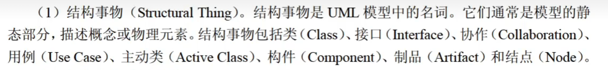

### 2. 行为事物

方法

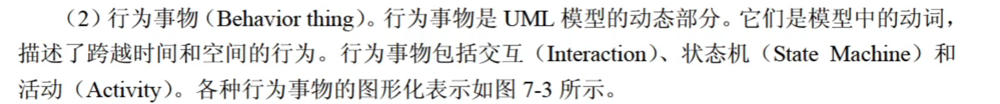

### 3. 分组事物

包

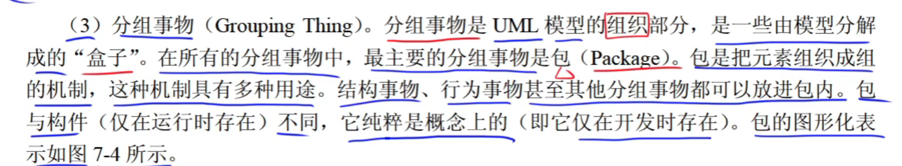

### 4. 注释事物

注解注释

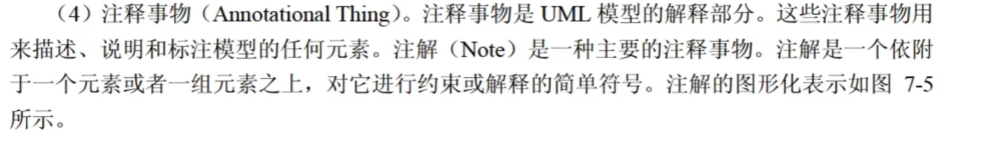

## 关系

UML中由4种关系：依赖、关联（包含聚合和组合）、泛化和实现。

### 依赖

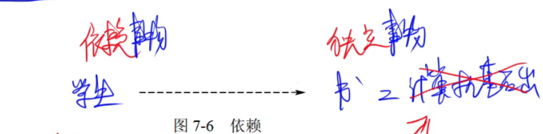

### 关联

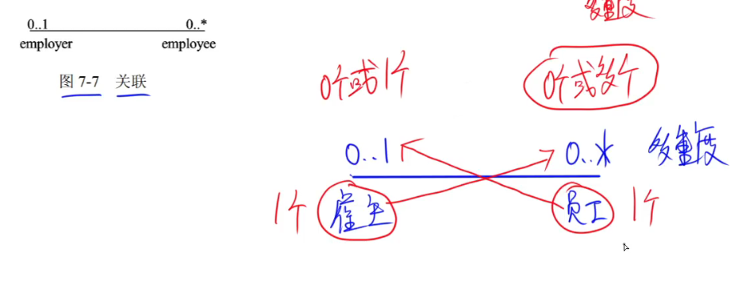

多对多的关系一般需要增加一个关联类

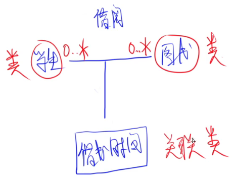

#### 聚合

部分和整体都是一个单独的个体，一方不存在，另一方仍然存在

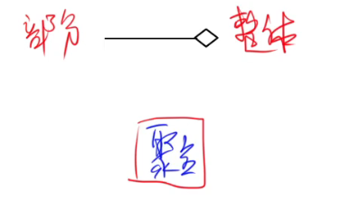

#### 组合

由整体决定了部分的生命周期，当整体不存在，部分也因为脱离整体而不复存在

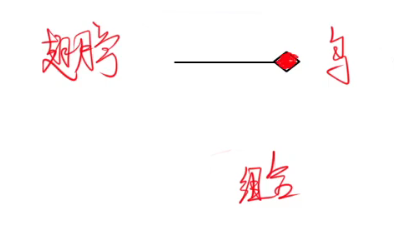

### 泛化

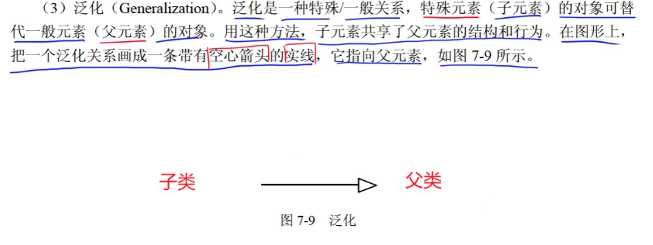

### 实现

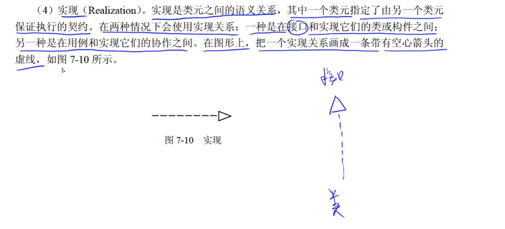

## 图

静态建模：类图、对象图、用例图

动态建模：序列图（顺序图、时序图）、通信图（协作图）、状态图、活动图

交互图：序列图（顺序图、时序图）、通信图（协作图）

物理建模：构件图（组件图）、部署图

### 1. 类图

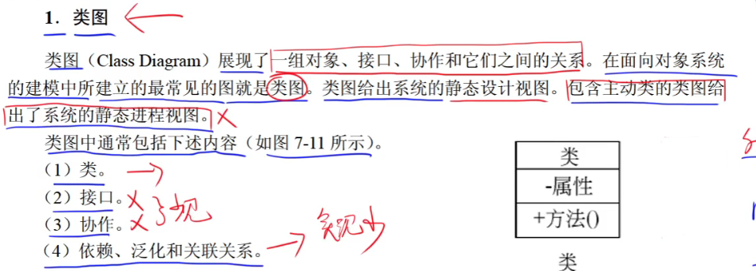

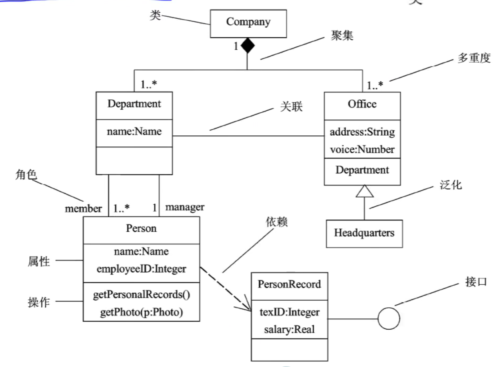

当对系统的静态设计视图建模时，通常以这3种方式之一使用类图、

1. 对系统的**词汇**建模
2. 对简单的**协作**建模
3. 对逻辑**数据库模式**建模

### 2.对象图

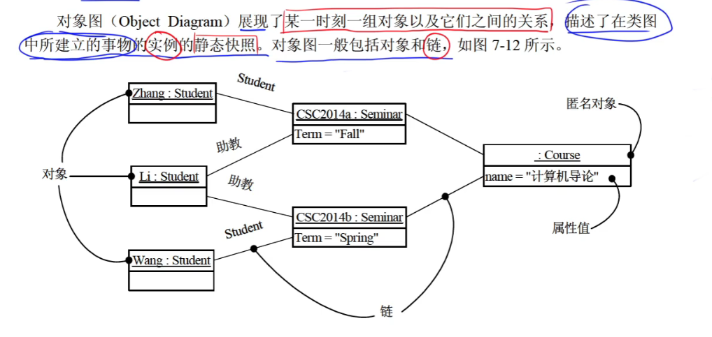

### 3.用例图

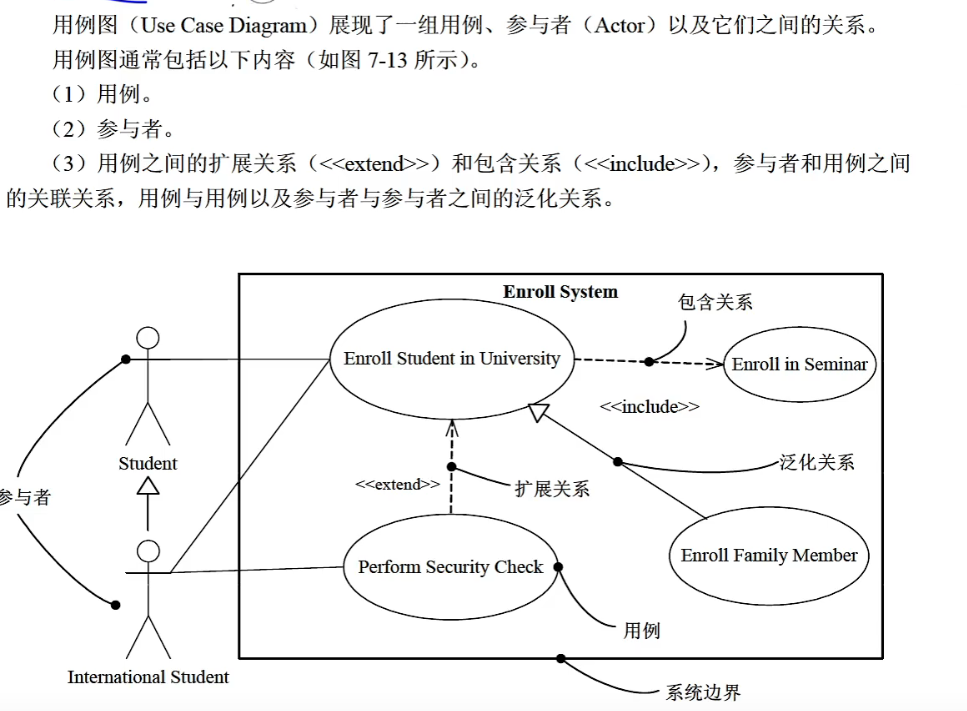

特征：

- 《extend》《include》
- 小人

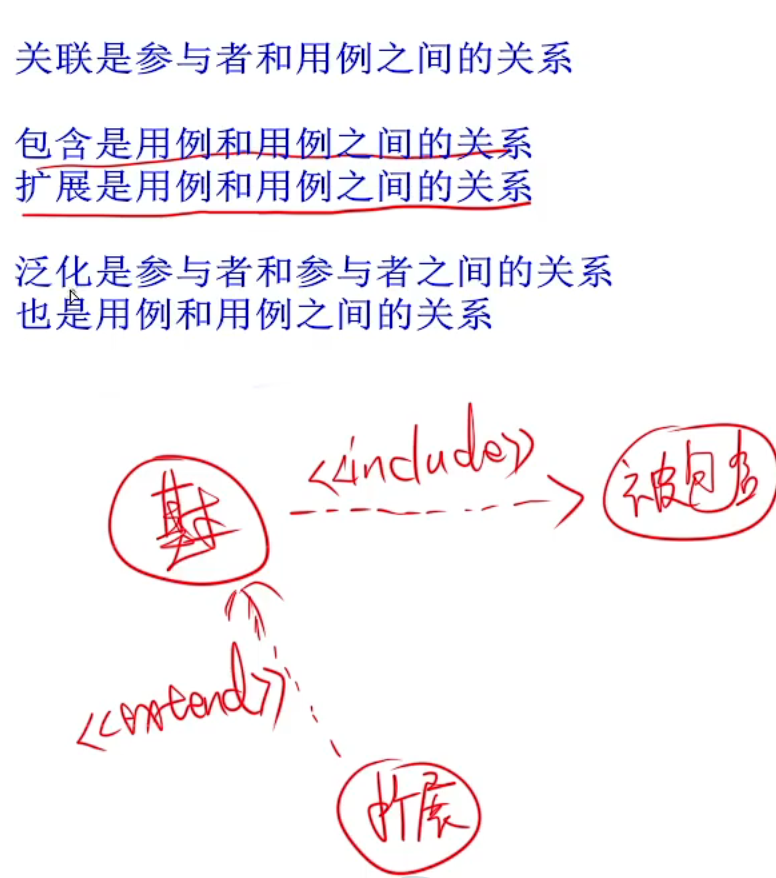

对系统的静态用例图建模时，可以使用这两种方式来使用用例图

1. 对系统的**语境**建模
2. 对系统的**需求**建模

### 4.序列图（顺序图、时序图）

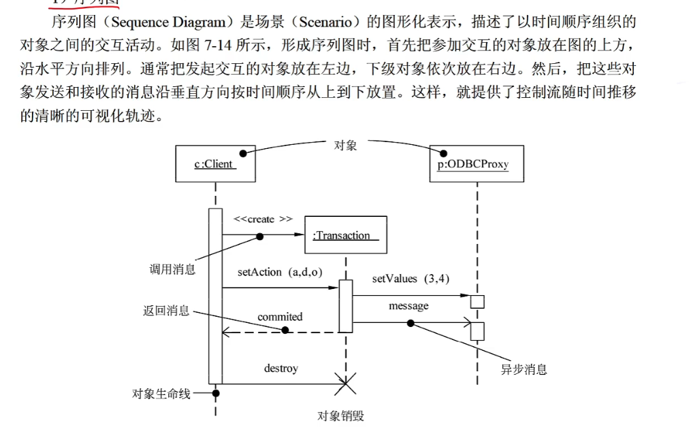

特征：

- 对象生命线
- 控制焦点

### 5.通信图（协作图）

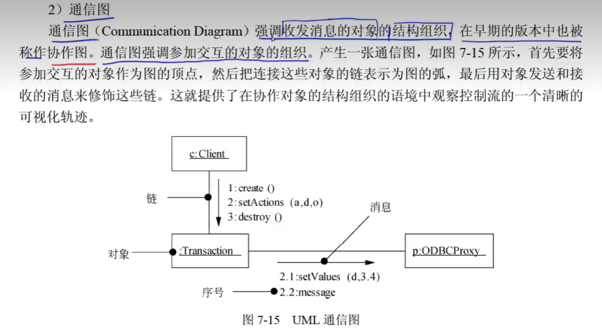

特征：

- 有条表示方向的途径
- 有顺序号

### 6.状态图

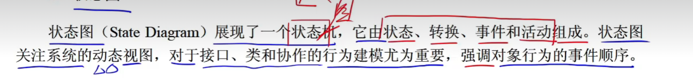

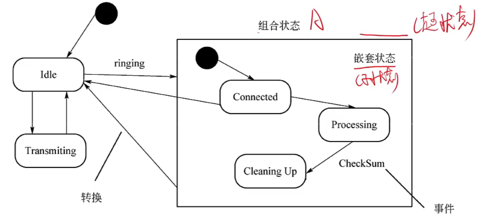

#### 状态和活动

状态是任何可以被观察到的系统行为模式，一个状态代表系统的一种行为模式。

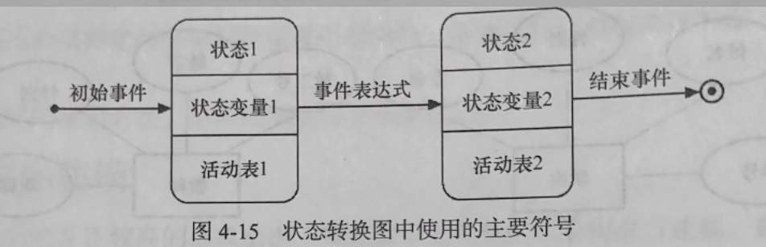

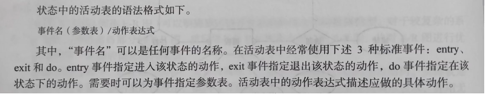

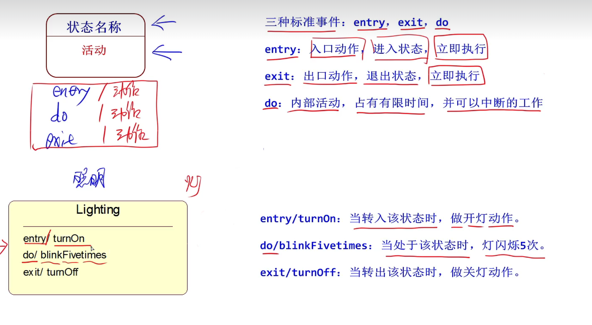

**活动（动作）可以在状态内执行，也可以在状态转换（迁移）时执行**

#### 转换（迁移）和事件

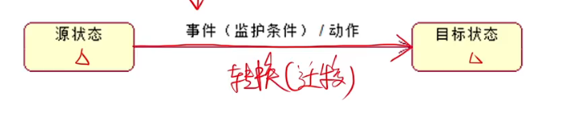

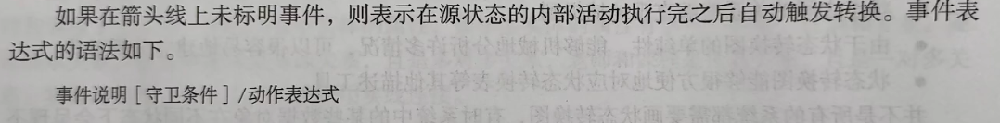

**转换包括两个状态（源状态，目标状态）、事件、监护条件、动作**

**事件触发转换（条件）**

### 7.活动图

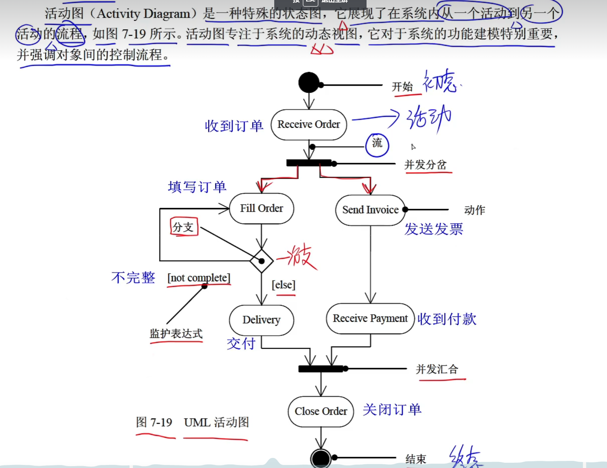

特征：

- 有菱形方块代表分支
- 并发分岔和并发会合

### 8.构件图（组件图）

一组构件之间的组织和依赖。

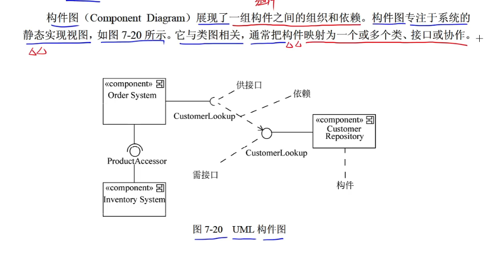

特征：

- 有特殊符号
- 半圆需接口和圆形供接口

### 9.部署图

**展现系统的软件和硬件之间的关系**

**在实施阶段使用**

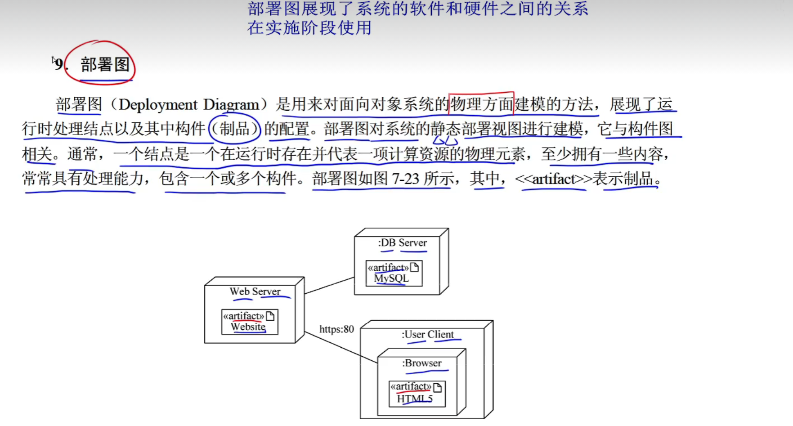