# 操作系统

## 操作系统地位

系统软件和应用软件都是建立在操作系统基础上的，可以看作是用户与计算机之间的接口

**系统软件**主要包括：操作系统、语言处理程序、数据库管理系统和服务程序等；而**应用软件**是为完成某种特定工作，解决一些具体问题而编写的程序，比如杀毒软件、办公软件等都属于应用软件。

## 进程状态及其状态间的切换

### 三态模型

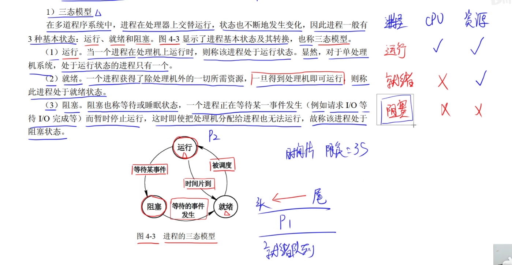

运行态 -> 阻塞态：当该进程需要的资源暂时需要等待时，该进程就会睡眠，cpu也不会继续执行该进程，等到该资源满足时，让该进程进入就绪状态

### 五态模型

 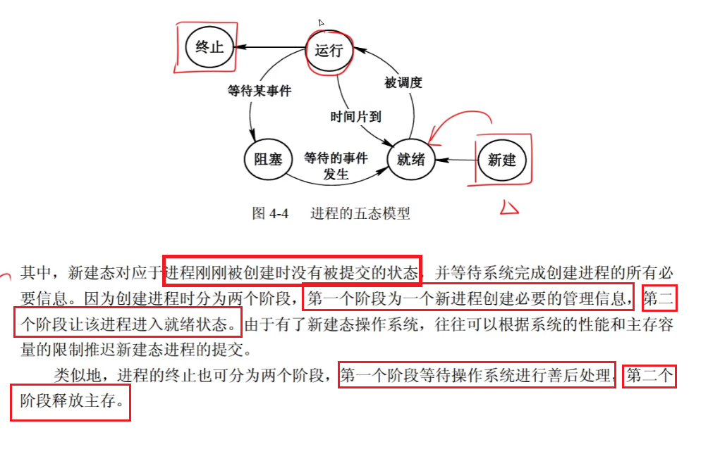

## 同步和互斥

互斥：保证临界资源同时只能由一个线程所拥有，具有唯一性和排它性。但互斥无法控制对资源的访问顺序

同步：保证共享资源的准确性，避免多线程情况下不同线程有不同结果，同步是指在互斥的基础上实现对资源的**有序访问**

临界资源：这类资源一次只能供一个进程使用

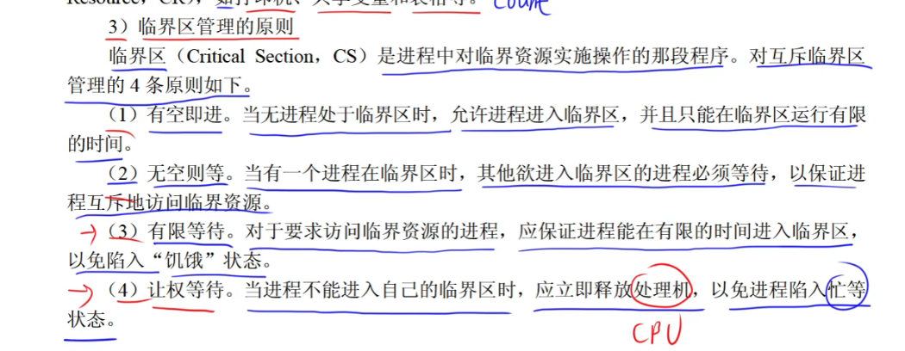

## 进程资源图

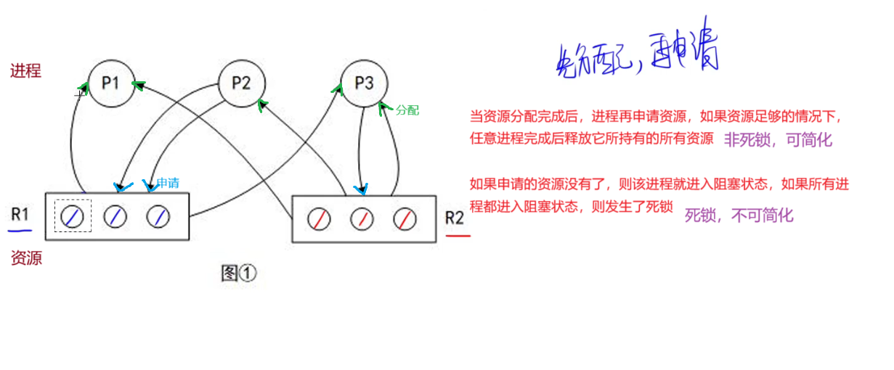

## 死锁避免

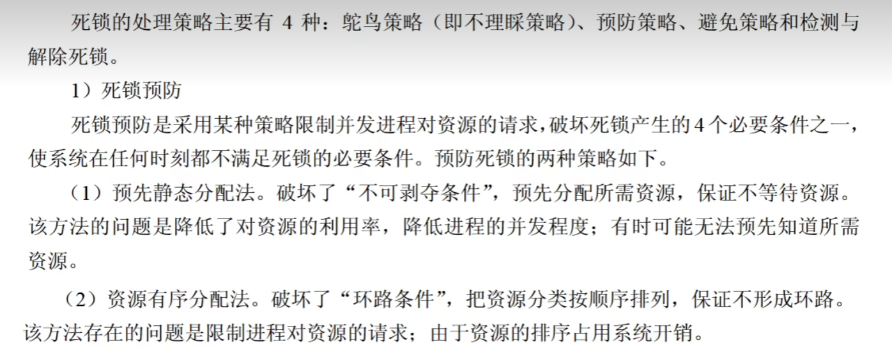

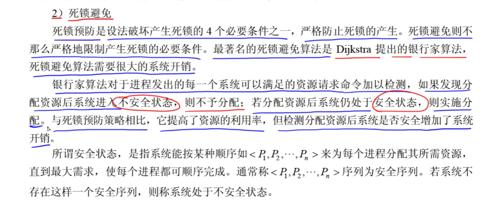

## 进程与线程

线程可以共享进程的资源，线程和线程之间不可共享

## 局部性原理

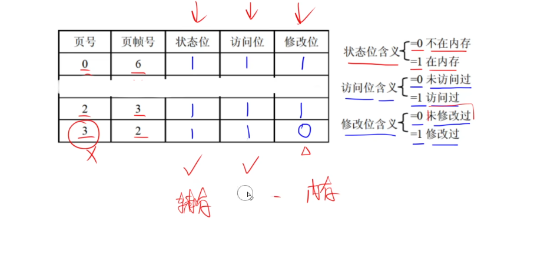

## 分页存储管理

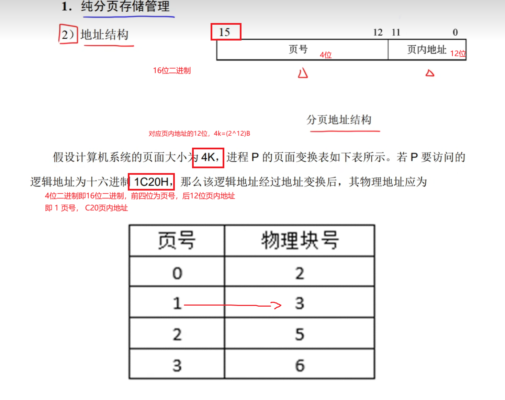

## 单缓冲区

单缓冲区：缓冲区空时io设备可输入，缓冲区满时给工作区传送，不可同时进行

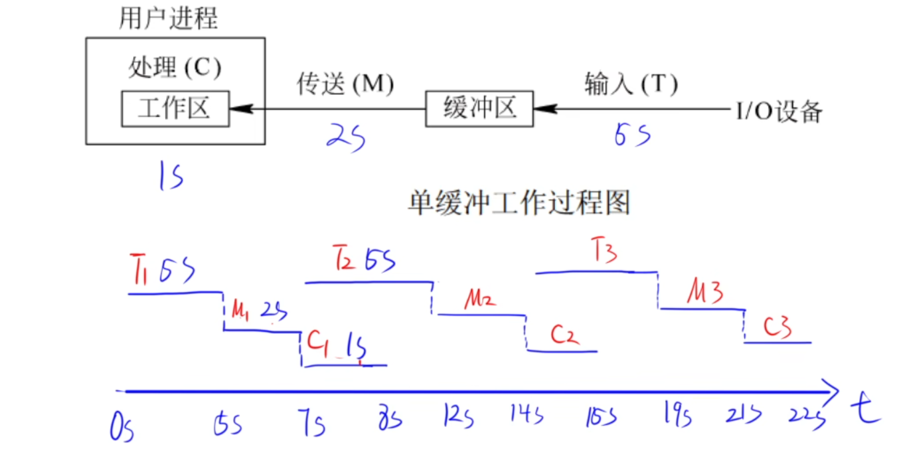

## 双缓冲区

比单缓冲区多一个缓冲区，在1缓冲区进行传送时，2缓冲区可以进行输入

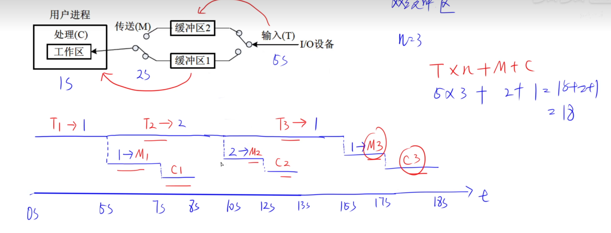

## 磁盘调度算法

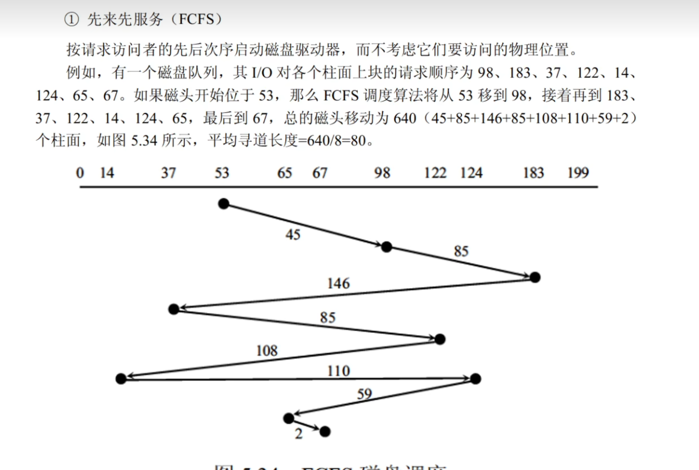

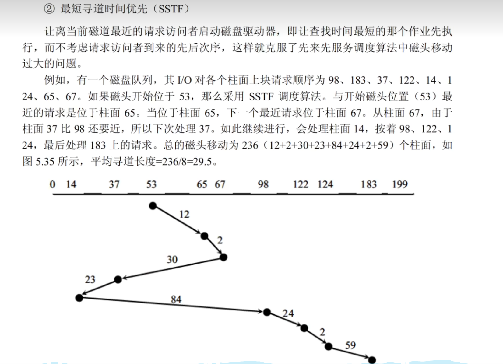

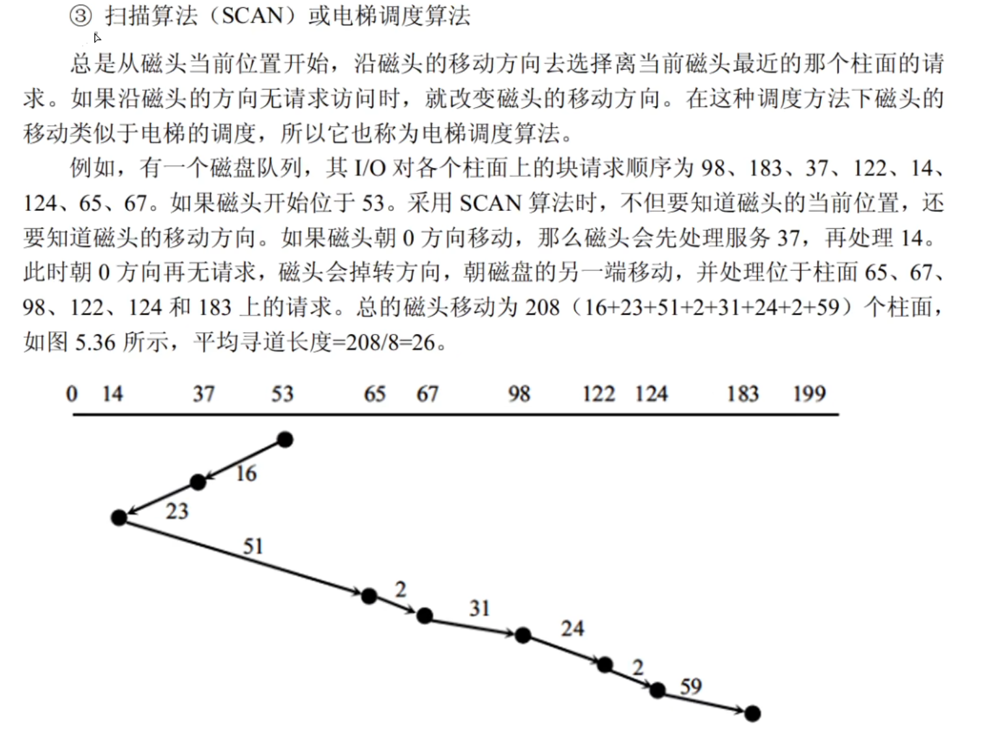

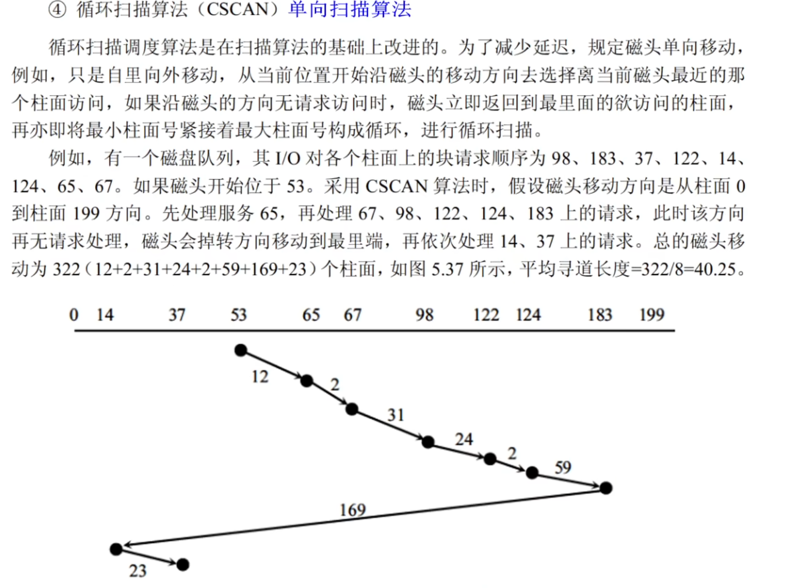

### 旋转调度算法

磁盘旋转是单方向不会停的，在数据处理过程中不读取数据（处理数据在该块读取完成后），如果处理时间超过了磁盘旋转到下一个位置的时间，那么只能在下一圈过来再读取

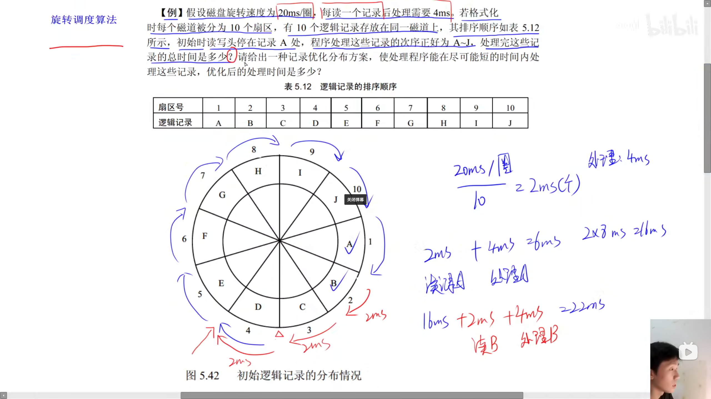

## 多级索引结构

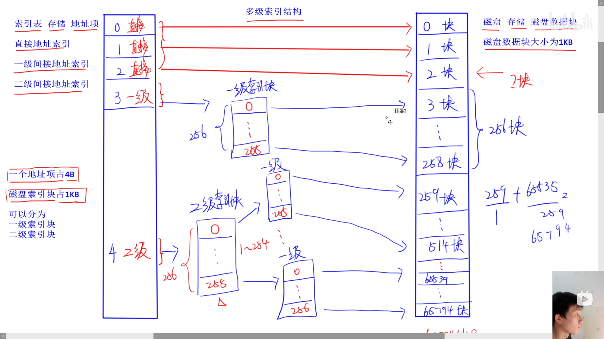
