# 网络安全

## 网络安全威胁

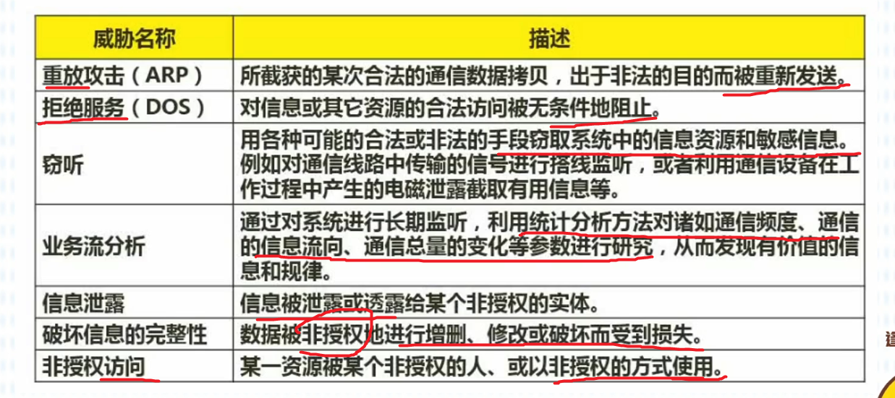

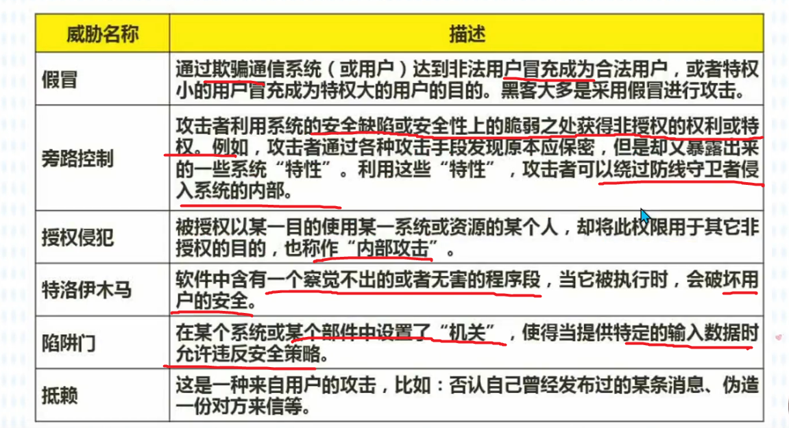

## 网络攻击

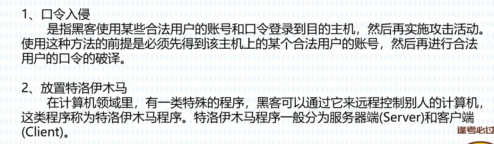

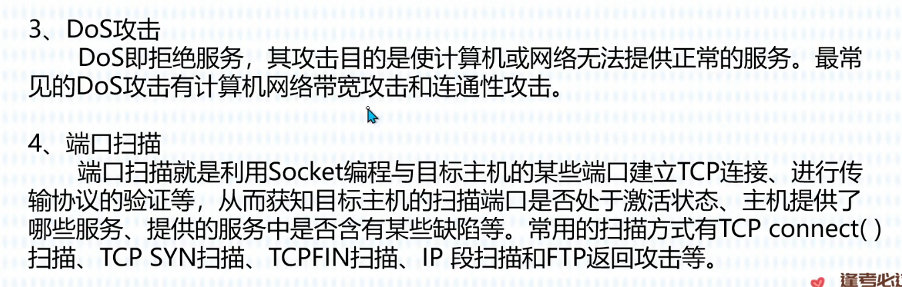

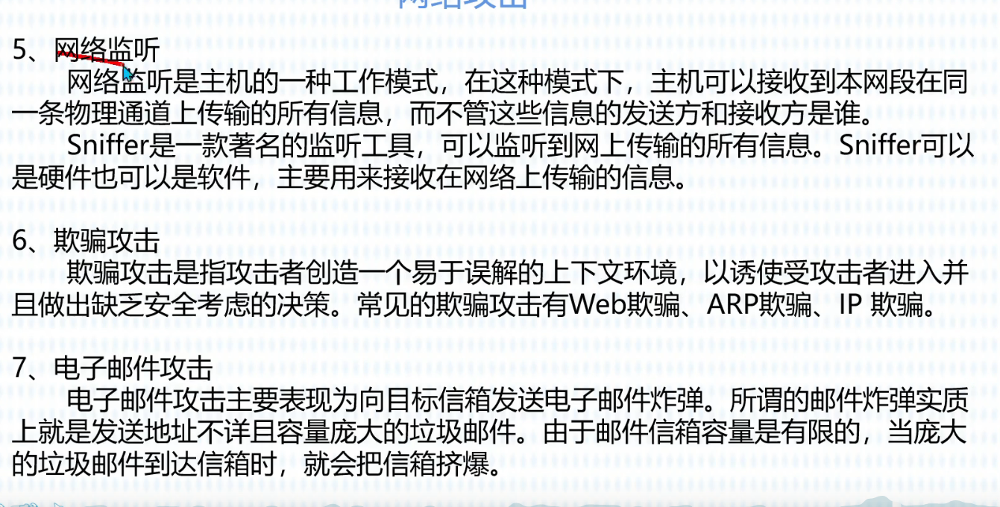

## 防火墙技术

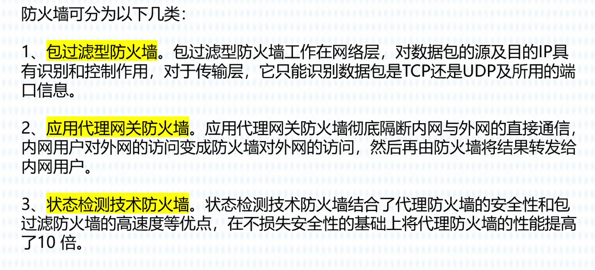

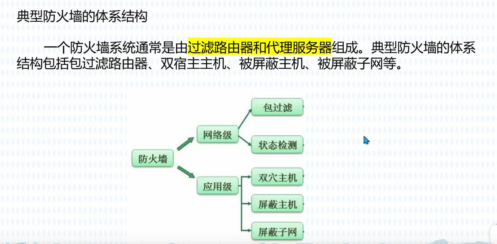

## 加密与数字签名

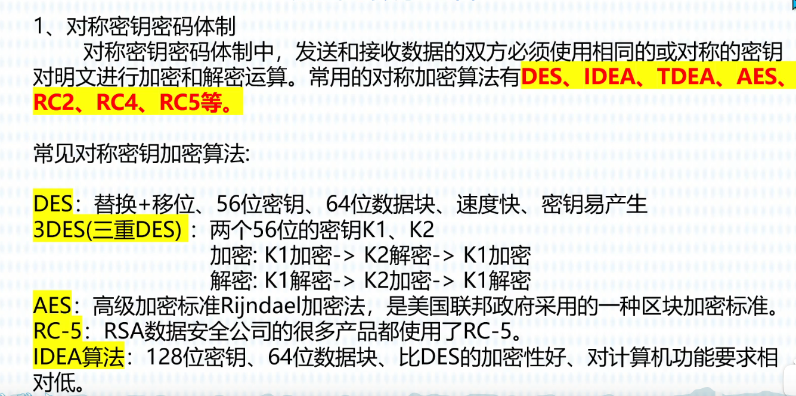

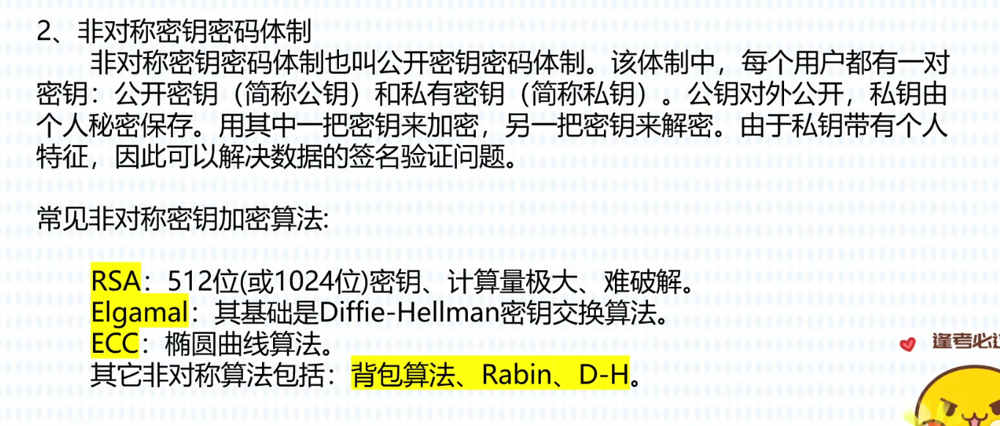

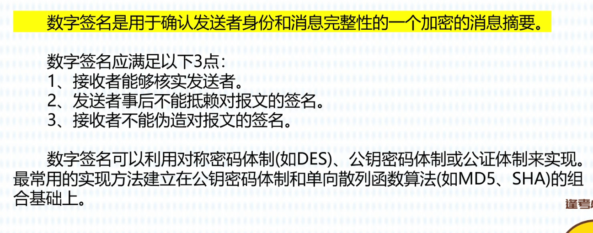

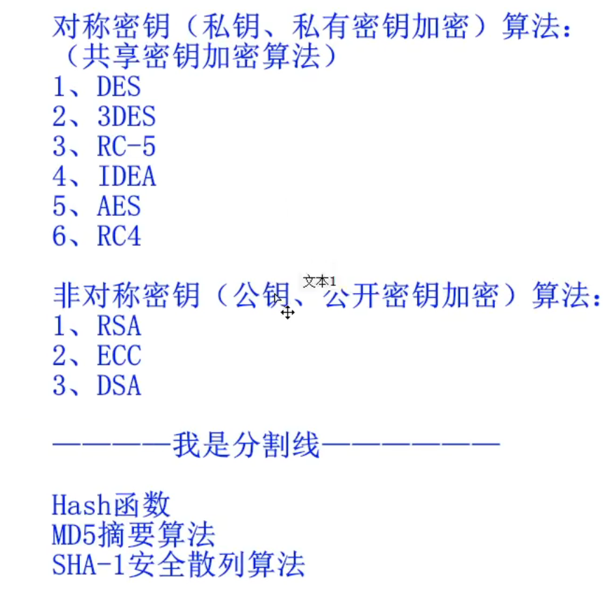

对称加密：加密快，密钥在信息中，还是会被**窃听**

非对称加密：加密慢，安全，一对不同的密钥保证信息**不被窃取**，加密明文时使用接收者的公钥加密，接收者使用私钥解密

信息摘要：将发送的明文进行hash算法后得到摘要放在密文后一起发送过去，解密后与摘要进行对比，如果一致，则没有被**篡改**

数字签名：用发送方私钥对摘要进行签名（加密），接收方用发送方公钥解密，如果成功，则可以得到摘要，并且确认发送方，防止**假冒**，**不能否认**信息的发送方。

数字证书：用户向CA机构（权威机构）申请数字证书，将个人信息和公钥发送给CA机构，CA机构颁给用户数字证书，数字证书用CA的私钥进行签名，用CA的公钥验证签名证书，得到用户的公钥。防止交换公钥的过程中公钥被他人替换。使用CA公钥验证CA的签名，确定对方的合法性

## 各个网络层次的安全保障

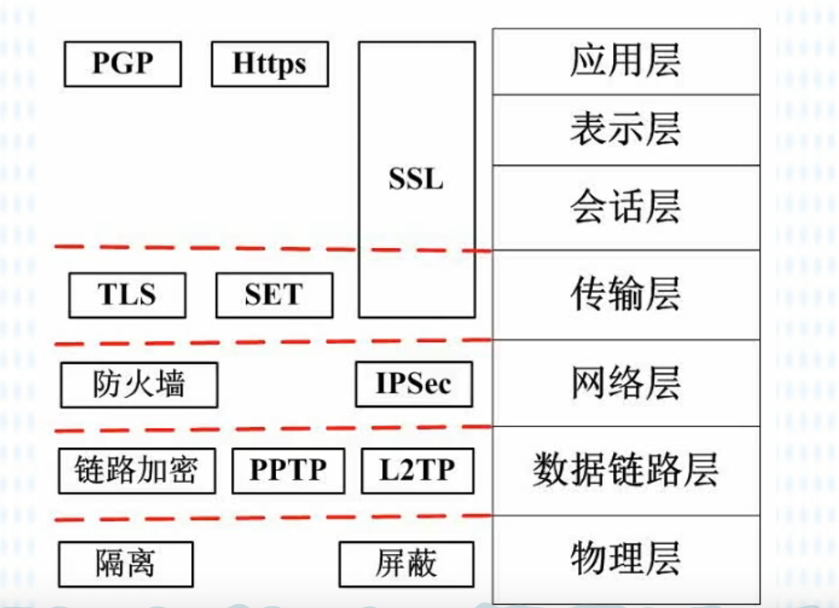