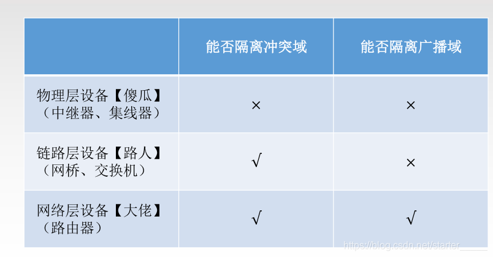
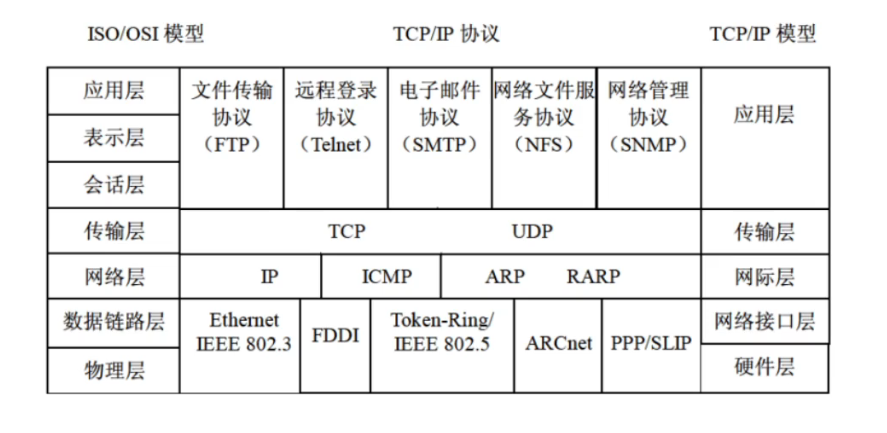
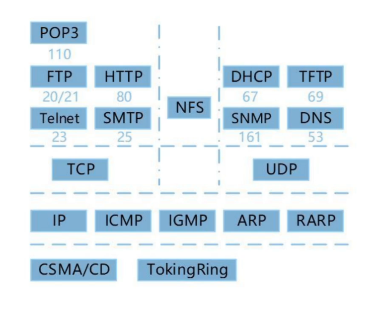
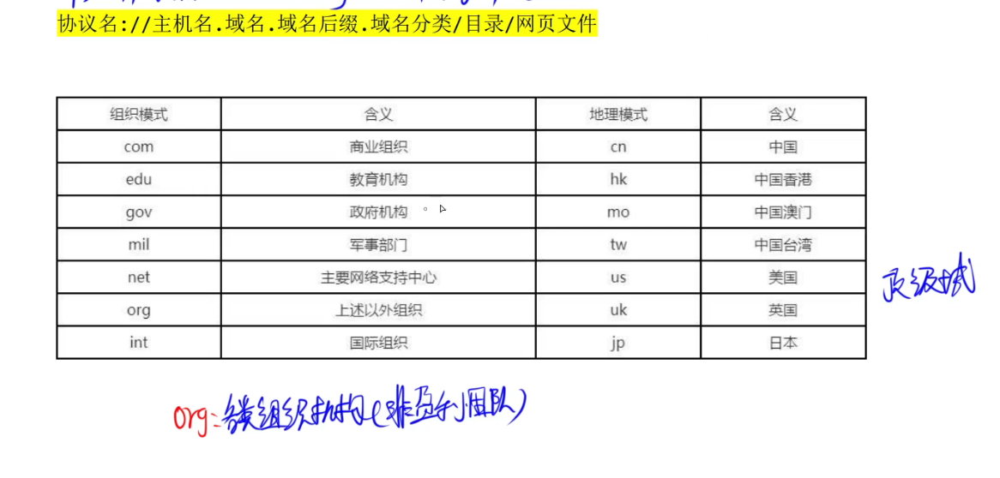
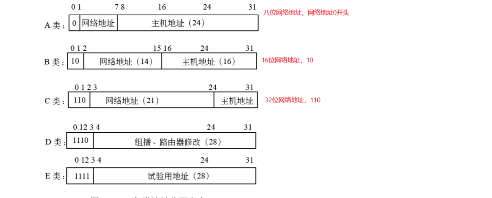
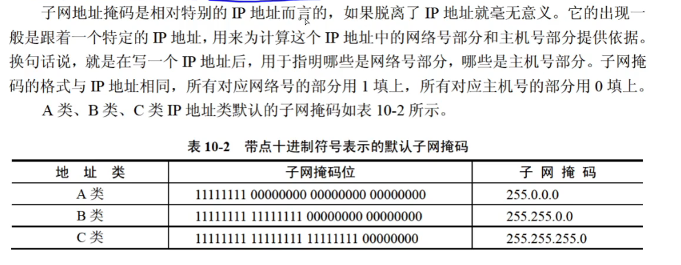
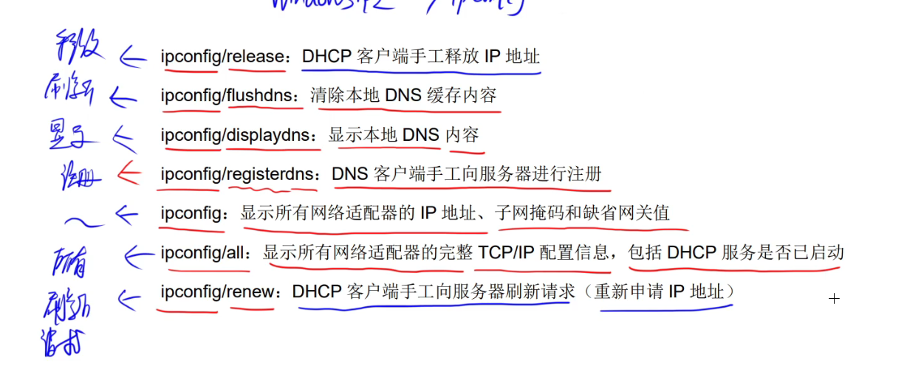

# 计算机网络

## 网络设备

1. 物理层：
   - 中继器：实现局域网网段互联，用于扩展局域网网段的长度
   - 集线器：可以看成多路中继器（多端口）
2. 数据链路层：
   - 网桥：用于连接两个局域网网段
   - 交换机：多端口的网桥
3. 网络层：
   - 路由器
4. 应用层：
   - 网关

## 协议簇

所有带T的除了TFTP都是TCP，不带T的除了POP3都是UDP。

## URL

子域名(三级域名后).二级域名.一级域名.顶级域名

某级域名其实是与顶级域名到该位置的组合
如：二级域名是二级域名.一级域名.顶级域名
www.bilibili.com 二级域名：www.bilibili.com；一级域名：bilibili.com；顶级域名com

## IP地址

### 子网掩码

子网个数的计算：
通过子网掩码来计算，比如一个网络的子网掩码 /20：255.255.240.0，划分为 /24 的子网，则有2^(24-20)个子网。解析：子网 /24 一共可以在 /20 中借走4位来组成不同子网，即有2^(24-20)种不同的子网，11111111.11111111.11110000.x 到 11111111.11111111.11111111.x

## Windons命令

