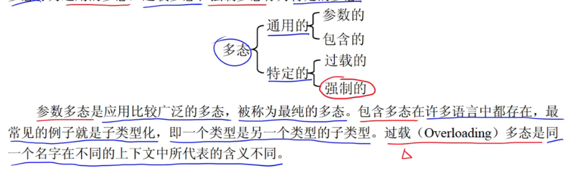
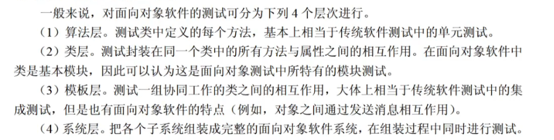

# 面向对象

## 多态分类

 

## 面向对象设计原则

1. 单一职责原则：一个类只做一种类型责任，引起该类变化的原因也则有一个
2. 开放-封闭原则
3. 里氏替换原则
4. 依赖反转原则：依赖抽象，不依赖实现，高层模块不应该依赖于底层模块，应该依赖于抽象
5. 接口分离原则：依赖抽象，不依赖具体
6. 重用发布等价原则：重用的粒度就是发布的粒度
7. 共同封闭原则：一个变化若只对一个包产生影响，则对该包中的所有类产生影响，不影响其它包
8. 共同重用原则：重用了包中的一个类，就要重用该包中的所有类
9. 无环依赖原则：包的依赖关系图中不允许存在环
10. 稳定依赖原则：朝着稳定的方向进行依赖
11. 稳定抽象原则：包的抽象程度应该和其稳定程度一致

## 面向对象分析（OOA）

侧重于理解问题，描述软件要做什么

1. 认定对象：确定应用的实体对象
2. 组织对象：把实体对象抽象成类，简化实体对象
3. 描述对象间的相互作用：各对象的关系
4. 确定对象的操作：对象的操作
5. 定义对象的内部信息

## 面向对象设计（OOD）

侧重于理解解决方案

面向对象设计(Object--Oriented Design,OOD)是将OOA所创建的分析模型转化为设计模型，其目标是定义系统构造蓝图。
OOD在复用OOA模型的基础上，包含与OOA对应如下五个活动。

1. 识别类及对象。
2. 定义属性。
3. 定义服务。
4. 识别关系。
5. 识别包。

## 面向对象编程（OOP）

## 面向对象测试

